<pre>
OIP: OIP-0003
Title: OPNet Plugin System
Author: BlobMaster41
Status: Confirmed
Type: Standards Track (Application Layer)
Category: Core
Created: 2025-12-15
License: Apache-2.0
Requires:
Replaces:
</pre>

## Abstract

This OIP specifies a comprehensive plugin system for opnet-node, enabling third-party developers to extend node
functionality through `.opnet` binary packages. Plugins are compiled TypeScript bundles (via bytenode) with JSON
metadata, signed using MLDSA post-quantum cryptography. The system provides isolated execution via worker threads,
permission-based access control, and hooks into blockchain lifecycle events including block processing, epoch changes,
mempool transactions, and API extensions. Plugins can extend both the HTTP REST API and WebSocket protobuf API while
maintaining isolation from core node operations.

## Motivation

The OPNet ecosystem requires extensibility to support diverse use cases without modifying core node code. Current
limitations include:

1. **No Extension Mechanism**: Node operators cannot add custom functionality without forking the codebase
2. **Ecosystem Fragmentation**: Each custom implementation diverges from mainline, complicating upgrades
3. **Security Concerns**: Arbitrary code execution in the node context poses significant risks
4. **Resource Management**: No standardized way to allocate compute, memory, and storage to extensions

A plugin system addresses these needs by providing:

- Standardized packaging format (`.opnet` binaries)
- Post-quantum signature verification via MLDSA
- Worker thread execution with permission-based access control
- Lifecycle hooks for blockchain events
- API extension capabilities (HTTP and WebSocket)
- Resource limits and monitoring

## Summary

The plugin system introduces:

1. **Binary Package Format**: `.opnet` files containing metadata, compiled bytecode, and MLDSA signatures
2. **Permission System**: Granular access control for database, blocks, epochs, mempool, api, threading, and filesystem
3. **Worker Pool Execution**: Plugins run in isolated worker threads with configurable resource limits
4. **Hook System**: Event-driven architecture for block/epoch/mempool/reorg lifecycle
5. **API Extensions**: HTTP route and WebSocket protobuf extensions without modifying core APIs
6. **Hot Reload**: Runtime loading, unloading, and updating of plugins
7. **Dependency Resolution**: Plugin-to-plugin dependencies with version constraints
8. **Network/Chain Awareness**: Plugins are aware of the chain ID and network they're running on
9. **Sync/Catch-up Mechanism**: Plugins can sync historical blocks without requiring a full reindex
10. **Install State Persistence**: Track plugin installation, sync status, and cleanup on uninstall
11. **Crash Reporting**: Automatic crash reports written to plugin directories with full state capture
12. **Reorg Safety**: Main thread completes all reorg operations before notifying plugins

## Specification

### Complete Architecture Overview

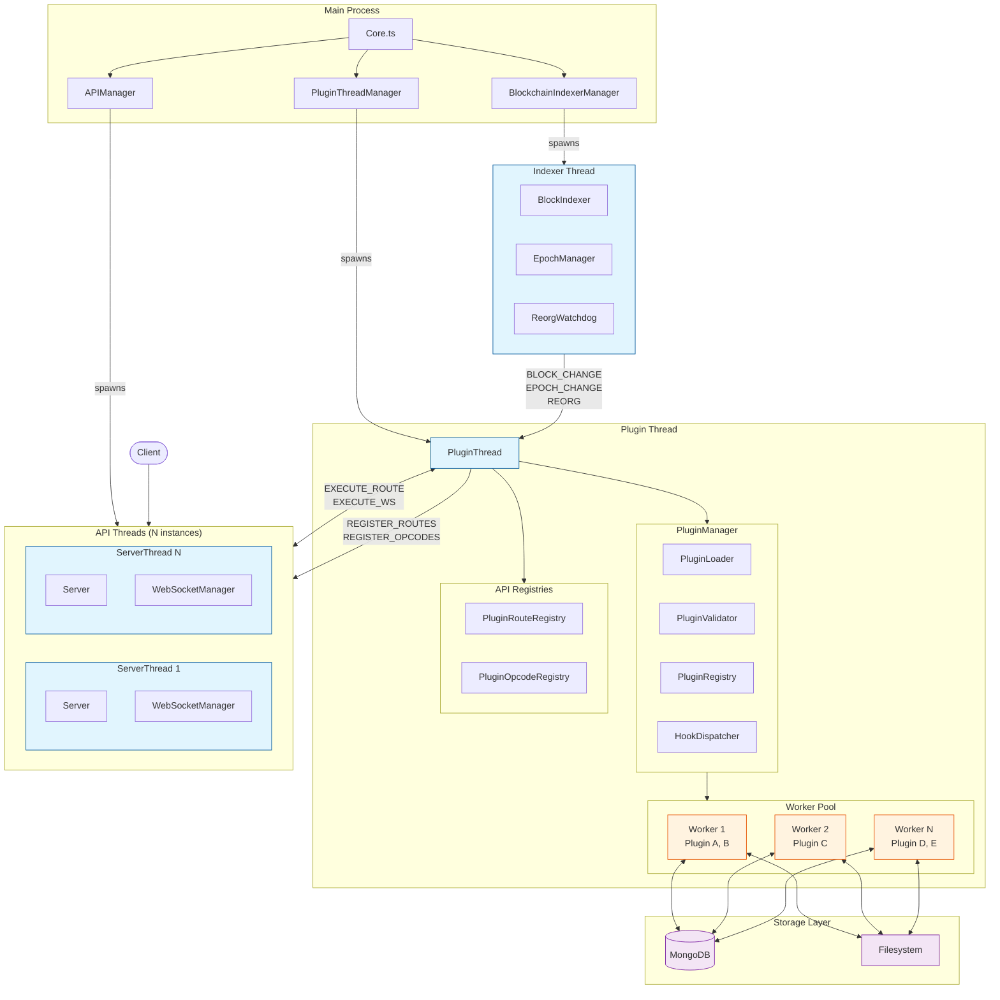

### Plugin Lifecycle Flow

```mermaid
flowchart LR
    subgraph Discovery["1. Discovery"]
        SCAN[Scan plugins/]
        PARSE[Parse .opnet]
    end

    subgraph Validation["2. Validation"]
        SIG[Verify MLDSA Signature]
        META[Validate Metadata]
        DEPS[Check Dependencies]
    end

    subgraph Loading["3. Loading"]
        ALLOC[Allocate Worker]
        LOAD[Load Bytecode]
        CTX[Create Context]
    end

    subgraph Initialization["4. Initialization"]
        FIRST{First Install?}
        NETINIT[onNetworkInit]
        ONLOAD[onLoad]
    end

    subgraph Startup["5. Startup Checks"]
        REINDEX{Reindex?}
        SYNC{Sync?}
        ENABLE[onEnable]
    end

    subgraph Running["6. Running"]
        HOOKS[Receive Hooks]
        API[Handle API]
    end

    Discovery --> Validation --> Loading --> Initialization
    Initialization --> Startup --> Running

    SCAN --> PARSE
    PARSE --> SIG --> META --> DEPS
    DEPS --> ALLOC --> LOAD --> CTX
    CTX --> FIRST
    FIRST -->|Yes| FIRSTINSTALL[onFirstInstall]
    FIRST -->|No| NETINIT
    FIRSTINSTALL --> NETINIT --> ONLOAD
    ONLOAD --> REINDEX
    REINDEX -->|Yes| HANDLEREINDEX[handleReindex]
    REINDEX -->|No| SYNC
    HANDLEREINDEX --> SYNC
    SYNC -->|Yes| SYNCBLOCKS[Sync Blocks]
    SYNC -->|No| ENABLE
    SYNCBLOCKS --> ENABLE
    ENABLE --> HOOKS
    HOOKS --> API
```

### Message Flow Architecture

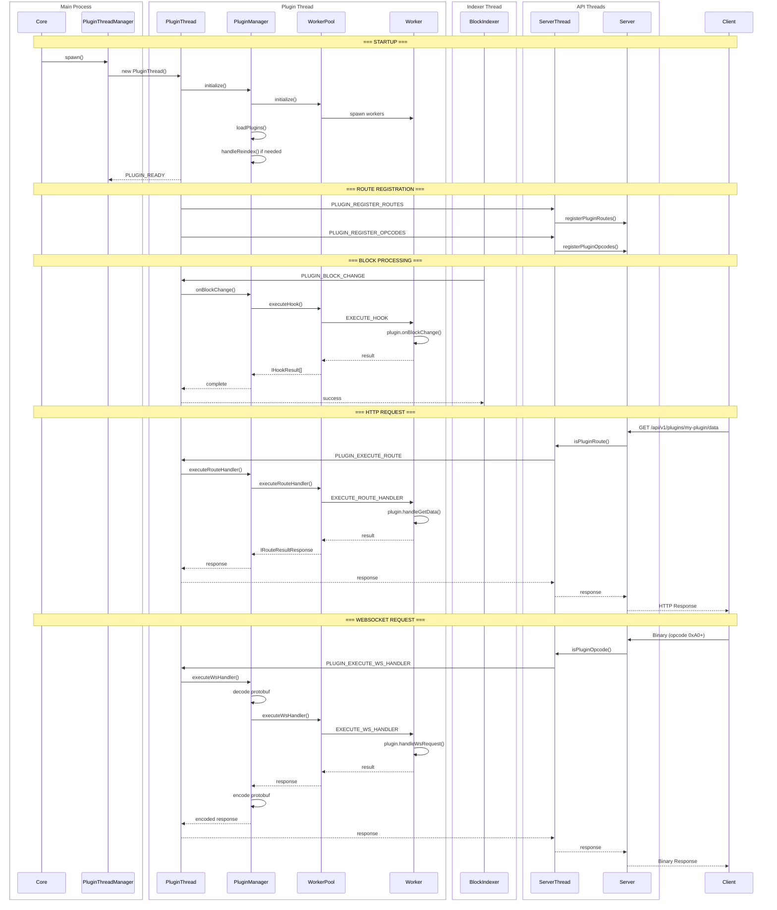

### Worker Pool Architecture

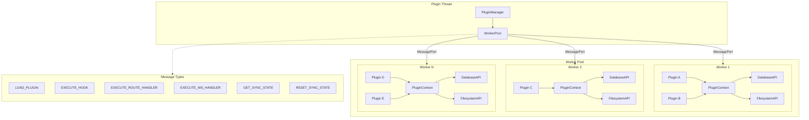

---

### 1. Plugin Binary Format (.opnet)

The `.opnet` file is a binary container with the following structure:

| Offset | Size (bytes) | Field           | Description                             |
|--------|--------------|-----------------|-----------------------------------------|
| 0      | 8            | MAGIC_BYTES     | `OPNETPLG` (0x4F504E4554504C47)         |
| 8      | 4            | FORMAT_VERSION  | uint32 LE, current: 1                   |
| 12     | 1            | MLDSA_LEVEL     | 0=MLDSA44, 1=MLDSA65, 2=MLDSA87         |
| 13     | varies       | PUBLIC_KEY      | MLDSA public key (1312/1952/2592 bytes) |
| varies | varies       | SIGNATURE       | MLDSA signature over CHECKSUM           |
| varies | 4            | METADATA_LENGTH | uint32 LE, max 1MB                      |
| varies | varies       | METADATA        | JSON-encoded plugin.json                |
| varies | 4            | BYTECODE_LENGTH | uint32 LE, max 100MB                    |
| varies | varies       | BYTECODE        | Bytenode compiled .jsc                  |
| varies | 4            | PROTO_LENGTH    | uint32 LE (0 if none), max 1MB          |
| varies | varies       | PROTO           | Optional .proto file content            |
| varies | 32           | CHECKSUM        | SHA-256(METADATA + BYTECODE + PROTO)    |

#### MLDSA Key/Signature Sizes

| Level   | Public Key | Signature  | NIST Security |
|---------|------------|------------|---------------|
| MLDSA44 | 1312 bytes | 2420 bytes | Level 2       |
| MLDSA65 | 1952 bytes | 3309 bytes | Level 3       |
| MLDSA87 | 2592 bytes | 4627 bytes | Level 5       |

MLDSA44 (Level 2) is the RECOMMENDED default for plugin signatures.

### 2. Plugin Metadata Schema

The METADATA section MUST contain valid JSON conforming to this schema:

```json
{
    "name": "string (required, ^[a-z][a-z0-9-]*$, max 64 chars)",
    "version": "string (required, semver format)",
    "opnetVersion": "string (required, semver range)",
    "main": "string (required, path to .jsc in bytecode)",
    "target": "bytenode",
    "type": "plugin",
    "checksum": "string (required, sha256:hex format)",
    "author": {
        "name": "string (required)",
        "email": "string (optional)",
        "url": "string (optional)"
    },
    "description": "string (optional, max 500 chars)",
    "license": "string (optional, SPDX identifier)",
    "repository": {
        "type": "string",
        "url": "string"
    },
    "pluginType": "standalone | library",
    "dependencies": {
        "plugin-name": "semver range"
    },
    "signature": {
        "algorithm": "MLDSA44 | MLDSA65 | MLDSA87",
        "publicKeyHash": "sha256:hex (32 bytes)"
    },
    "permissions": {},
    "resources": {},
    "lifecycle": {}
}
```

### 3. Permission System

Plugins MUST declare required permissions in metadata. The node MUST enforce these permissions at runtime.

Permission categories: `database`, `blocks`, `epochs`, `mempool`, `api`, `threading`, `filesystem`.

#### 3.1 Database Permissions

```json
{
    "database": {
        "enabled": true,
        "collections": [
            "prefix_collection1",
            "prefix_collection2"
        ],
        "indexes": {
            "prefix_collection1": [
                {
                    "keys": {
                        "field": 1,
                        "timestamp": -1
                    },
                    "options": {
                        "name": "idx_field",
                        "unique": true
                    }
                }
            ]
        }
    }
}
```

Supported index key types: `1`, `-1`, `"text"`, `"2dsphere"`, `"2d"`, `"hashed"`.

#### 3.2 Block Permissions

```json
{
    "blocks": {
        "preProcess": true,
        "postProcess": true,
        "onChange": true
    }
}
```

#### 3.3 Epoch Permissions

```json
{
    "epochs": {
        "onChange": true,
        "onFinalized": true
    }
}
```

#### 3.4 Mempool Permissions

```json
{
    "mempool": {
        "txFeed": true,
        "txSubmit": false
    }
}
```

#### 3.5 API Permissions

```json
{
    "api": {
        "addEndpoints": true,
        "addWebsocket": false,
        "basePath": "/plugins/my-plugin",
        "routes": [
            {
                "path": "prices",
                "method": "GET",
                "handler": "handleGetPrices",
                "rateLimit": 100
            }
        ],
        "websocket": {
            "protoFile": "protocol.proto",
            "namespace": "MyPluginProtocol",
            "handlers": [
                {
                    "opcode": "GET_DATA",
                    "requestType": "GetDataRequest",
                    "responseType": "GetDataResponse",
                    "handler": "handleGetData",
                    "pushType": "DataNotification"
                }
            ]
        }
    }
}
```

#### 3.6 Threading Permissions

```json
{
    "threading": {
        "maxWorkers": 4,
        "maxMemoryMB": 512
    }
}
```

Default: `maxWorkers=1`, `maxMemoryMB=256`.

#### 3.7 Filesystem Permissions

```json
{
    "filesystem": {
        "configDir": true,
        "tempDir": true
    }
}
```

### 4. Resource Limits

```json
{
    "resources": {
        "memory": {
            "maxHeapMB": 256,
            "maxOldGenMB": 128,
            "maxYoungGenMB": 64
        },
        "cpu": {
            "maxThreads": 2,
            "priority": "low | normal | high"
        },
        "timeout": {
            "initMs": 30000,
            "hookMs": 5000,
            "shutdownMs": 10000
        }
    }
}
```

### 5. Lifecycle Configuration

```json
{
    "lifecycle": {
        "loadPriority": 100,
        "enabledByDefault": true,
        "requiresRestart": false
    }
}
```

Load priority determines order (lower values load first). Default is 100.

### 6. Plugin Interface

Plugins MUST export a class implementing `IPlugin`:

```typescript
export interface IPlugin {
    // Lifecycle hooks
    onLoad?(context: PluginContext): Promise<void>;

    onUnload?(): Promise<void>;

    onEnable?(): Promise<void>;

    onDisable?(): Promise<void>;

    // First install hook (called once on first installation)
    onFirstInstall?(networkInfo: INetworkInfo): Promise<void>;

    // Network initialization (called on every load)
    onNetworkInit?(networkInfo: INetworkInfo): Promise<void>;

    // Sync/catch-up hooks (BLOCKING - indexer waits for sync)
    onSyncRequired?(syncCheck: IPluginSyncCheck): Promise<boolean>;

    onSyncBlock?(block: ISyncBlockData, progress: ISyncProgress): Promise<void>;

    onSyncComplete?(finalBlock: bigint): Promise<void>;

    // Block hooks
    onBlockPreProcess?(block: BlockDataWithTransactionData): Promise<void>;

    onBlockPostProcess?(block: BlockProcessedData): Promise<void>;

    onBlockChange?(block: BlockProcessedData): Promise<void>;

    // Epoch hooks
    onEpochChange?(epoch: IEpochData): Promise<void>;

    onEpochFinalized?(epoch: IEpochData): Promise<void>;

    // Mempool hooks
    onMempoolTransaction?(tx: IMempoolTransaction): Promise<void>;

    // Reorg hook (CRITICAL - blocking, sequential)
    onReorg?(reorg: IReorgData): Promise<void>;

    // Reindex hooks (CRITICAL - blocking, called at startup when reindex enabled)
    onReindexRequired?(reindexCheck: IReindexCheck): Promise<boolean>;

    onPurgeBlocks?(fromBlock: bigint, toBlock?: bigint): Promise<void>;

    // API extensions
    registerRoutes?(router: IPluginRouter): void;

    registerWebSocketHandlers?(ws: IPluginWebSocket): void;
}
```

### 7. Plugin Context

Plugins receive a context object on load:

```typescript
export interface PluginContext {
    readonly name: string;
    readonly version: string;
    readonly dataDir: string;
    readonly permissions: IPluginPermissions;

    // Network information
    readonly network: INetworkInfo;
    readonly isFirstInstall: boolean;
    readonly enabledAtBlock: bigint;

    readonly db?: IPluginDatabaseAPI;
    readonly fs: IPluginFilesystemAPI;
    readonly logger: IPluginLogger;
    readonly config: IPluginConfig;

    // Threading
    createWorker?(script: string): IPluginWorker;

    // Inter-plugin communication
    getPlugin<T extends IPlugin>(name: string): T | undefined;

    emit(event: string, data: unknown): void;

    on(event: string, handler: EventHandler): void;

    off(event: string, handler: EventHandler): void;

    // Sync status methods
    getCurrentBlockHeight(): bigint;

    getLastSyncedBlock(): bigint;

    isSynced(): boolean;

    getSyncStatus(): IPluginSyncCheck;

    updateLastSyncedBlock(blockHeight: bigint): Promise<void>;

    markSyncCompleted(): Promise<void>;

    // Reindex methods
    isReindexEnabled(): boolean;

    getReindexInfo(): IReindexInfo | undefined;

    getReindexFromBlock(): bigint | undefined;

    getReindexCheck(): IReindexCheck | undefined;

    requiresReindexHandling(): boolean;

    resetSyncStateToBlock(blockHeight: bigint): Promise<void>;
}

interface INetworkInfo {
    readonly chainId: bigint;
    readonly network: 'mainnet' | 'testnet' | 'regtest';
    readonly currentBlockHeight: bigint;
    readonly genesisBlockHash: string;
    readonly reindex?: IReindexInfo;  // Present when reindex mode is active
}

interface IReindexInfo {
    readonly enabled: boolean;
    readonly fromBlock: bigint;       // Block to reindex from (0 = full reindex)
    readonly inProgress: boolean;
}

interface IReindexCheck {
    readonly reindexEnabled: boolean;
    readonly reindexFromBlock: bigint;
    readonly pluginLastSyncedBlock: bigint;
    readonly action: ReindexAction;   // NONE, PURGE, SYNC, RESET
    readonly requiresPurge: boolean;
    readonly purgeToBlock?: bigint;
    readonly requiresSync: boolean;
    readonly syncFromBlock?: bigint;
    readonly syncToBlock?: bigint;
}

enum ReindexAction {
    NONE = 'none',      // Plugin data is compatible
    PURGE = 'purge',    // Must delete data beyond reindex block
    SYNC = 'sync',      // Must sync up to reindex block
    RESET = 'reset',    // Full reset required
}
```

### 8. Signature Verification

Plugins MUST be signed using MLDSA. Verification algorithm:

1. Extract MLDSA_LEVEL from header
2. Read PUBLIC_KEY (size determined by level)
3. Read SIGNATURE (size determined by level)
4. Compute CHECKSUM over (METADATA + BYTECODE + PROTO)
5. Verify signature using `MessageSigner.verifyMLDSASignature()`

```typescript
import { QuantumBIP32Factory, MessageSigner, MLDSASecurityLevel } from '@btc-vision/transaction';

function verifyPluginSignature(
    publicKey: Buffer,
    checksum: Buffer,
    signature: Buffer,
    level: MLDSASecurityLevel
): boolean {
    const keyPair = QuantumBIP32Factory.fromPublicKey(
        publicKey,
        Buffer.alloc(32),
        network,
        level
    );
    return MessageSigner.verifyMLDSASignature(keyPair, checksum, signature);
}
```

### 9. Thread Architecture

The plugin system uses a multi-thread architecture with cross-thread communication via MessagePort:

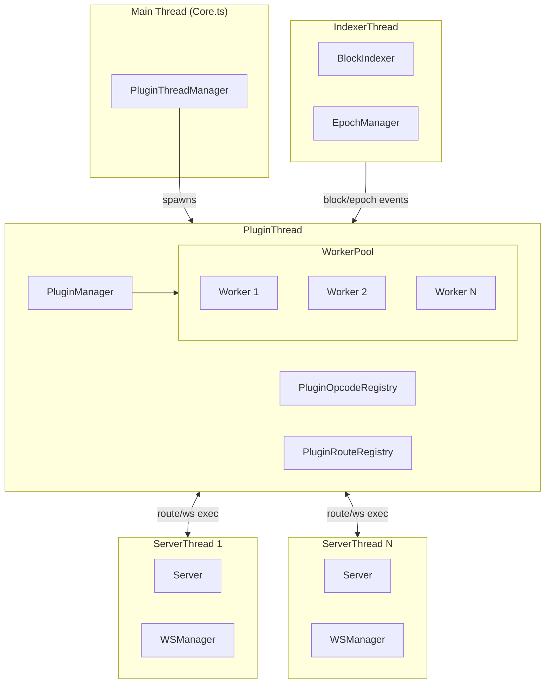

#### 9.1 PluginThread

Runs in a dedicated worker thread, manages:

- `PluginManager`: Plugin lifecycle and registry
- `PluginWorkerPool`: Worker threads for plugin execution
- `PluginOpcodeRegistry`: WebSocket opcode allocation and handlers
- `PluginRouteRegistry`: HTTP route registration

#### 9.2 ServerThread (API Thread)

Multiple instances handle HTTP/WebSocket requests:

- Routes plugin HTTP requests to PluginThread via `PLUGIN_EXECUTE_ROUTE`
- Routes plugin WebSocket requests via `PLUGIN_EXECUTE_WS_HANDLER`
- Receives route/opcode registrations from PluginThread

#### 9.3 Cross-Thread Message Types

```typescript
enum MessageType {
    PLUGIN_REGISTER_ROUTES = 'plugin:register_routes',
    PLUGIN_UNREGISTER_ROUTES = 'plugin:unregister_routes',
    PLUGIN_REGISTER_OPCODES = 'plugin:register_opcodes',
    PLUGIN_UNREGISTER_OPCODES = 'plugin:unregister_opcodes',
    PLUGIN_EXECUTE_ROUTE = 'plugin:execute_route',
    PLUGIN_EXECUTE_WS_HANDLER = 'plugin:execute_ws_handler',
    PLUGIN_BLOCK_CHANGE = 'plugin:block_change',
    PLUGIN_EPOCH_CHANGE = 'plugin:epoch_change',
    PLUGIN_EPOCH_FINALIZED = 'plugin:epoch_finalized',
    PLUGIN_REORG = 'plugin:reorg',
    PLUGIN_READY = 'plugin:ready',
}
```

### 10. Hook Dispatch

| Hook                  | Trigger                   | Execution  | Timeout |
|-----------------------|---------------------------|------------|---------|
| onFirstInstall        | First plugin installation | Sequential | 60s     |
| onNetworkInit         | Every plugin load         | Sequential | 10s     |
| onLoad                | Plugin loading            | Sequential | 30s     |
| onUnload              | Plugin unloading          | Sequential | 10s     |
| onEnable              | Plugin enabled            | Sequential | 5s      |
| onDisable             | Plugin disabled           | Sequential | 5s      |
| onSyncRequired        | Before sync check         | Sequential | 5s      |
| onSyncBlock           | Each block during sync    | Sequential | 30s     |
| onSyncComplete        | Sync finished             | Sequential | 10s     |
| onBlockPreProcess     | Before block execution    | Parallel   | 5s      |
| onBlockPostProcess    | After block execution     | Parallel   | 5s      |
| onBlockChange         | New block confirmed       | Parallel   | 5s      |
| onEpochChange         | Epoch increments          | Parallel   | 5s      |
| onEpochFinalized      | Epoch merkle complete     | Parallel   | 5s      |
| onMempoolTransaction  | New mempool tx            | Parallel   | 2s      |
| onReorg               | Blockchain reorg          | Sequential | 300s    |
| **onReindexRequired** | Reindex mode startup      | Sequential | 600s    |
| **onPurgeBlocks**     | Data purge required       | Sequential | 600s    |

The `onReorg` hook is **CRITICAL** and **BLOCKING**. Plugins MUST revert state for blocks >= fromBlock.

The `onSyncRequired` hook is **BLOCKING**. The indexer will not start until all plugins have completed their sync.

The `onReindexRequired` and `onPurgeBlocks` hooks are **CRITICAL** and **BLOCKING**. Called at startup when
`REINDEX=true` in config. Plugins MUST handle reindex requirements before the node can start.

### 11. HTTP API Extension

Plugin routes are registered at `/api/v1/{basePath}/{path}`.

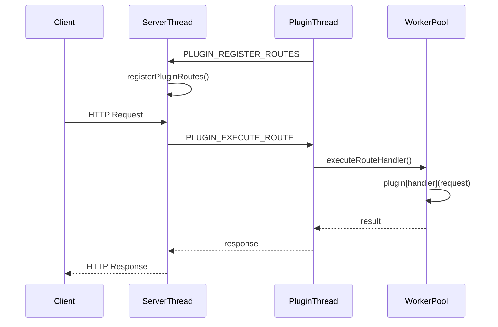

### 12. WebSocket API Extension

Plugins extend the WebSocket API using custom `.proto` definitions.

#### 12.1 Opcode Allocation

| Range     | Usage                           |
|-----------|---------------------------------|
| 0x00-0x9F | Core API requests (reserved)    |
| 0x80-0xBF | Core API responses (reserved)   |
| 0xA0-0xDF | Plugin requests (8 per plugin)  |
| 0xC0-0xFF | Plugin responses (8 per plugin) |

Base addresses: `PLUGIN_REQUEST_OPCODE_BASE = 0xA0`, `PLUGIN_RESPONSE_OPCODE_BASE = 0xC0`.

#### 12.2 WebSocket Request Flow

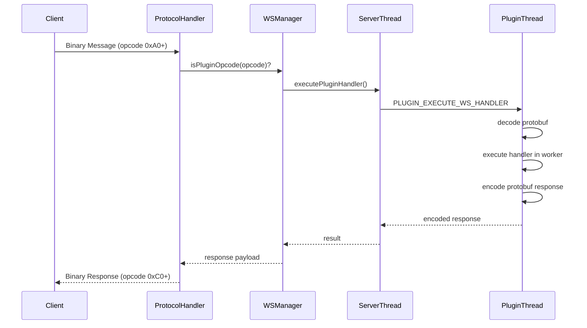

#### 12.3 Proto Loading

Plugin `.proto` files are embedded in the `.opnet` package and loaded via `protobufjs`:

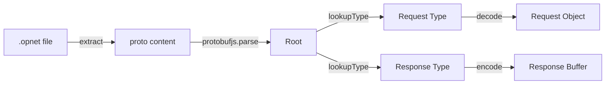

### 13. Plugin States

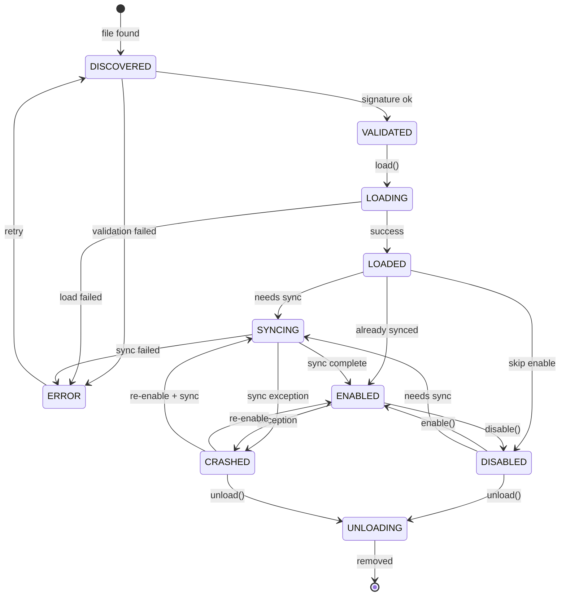

- SYNCING: Plugin is catching up with historical blocks (BLOCKING - indexer waits)
- CRASHED: Plugin disabled due to unhandled exception, requires manual re-enable
- Hot reload: ENABLED → UNLOADING → LOADING → SYNCING → ENABLED

### 14. Dependency Resolution

Dependencies are resolved using topological sort:

1. Build dependency graph from all registered plugins
2. Detect cycles (error if found)
3. Sort plugins in load order (dependencies first)
4. Validate version constraints

### 15. Plugin File Disable Convention

Plugins can be disabled without unloading by renaming the file:

```
my-plugin.opnet           # Enabled plugin
my-plugin.opnet.disabled  # Disabled plugin (not loaded on startup)
```

The plugin loader detects `.opnet.disabled` files and excludes them from automatic loading.

### 16. Sync/Catch-up Mechanism

Plugins that process blocks can fall behind if installed mid-chain or after downtime. The sync mechanism allows plugins
to catch up without requiring a full node reindex.

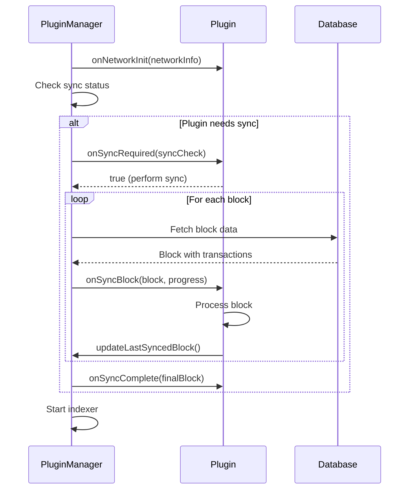

#### Sync Check Response

```typescript
interface IPluginSyncCheck {
    status: PluginSyncStatus;    // SYNCED, BEHIND, SYNCING, NEVER_SYNCED
    lastSyncedBlock: bigint;     // Last processed block
    chainTip: bigint;            // Current chain height
    blocksBehind: bigint;        // Blocks to catch up
    requiresSync: boolean;       // Whether sync is needed
}
```

### 17. Install State Persistence

Plugin installation state is persisted to the database for tracking and cleanup:

```typescript
interface IPluginInstallState {
    pluginId: string;
    installedVersion: string;
    chainId: bigint;
    network: string;
    installedAt: number;
    enabledAtBlock: bigint;      // Block when first enabled (default: 0)
    lastSyncedBlock: bigint;     // Last processed block
    syncCompleted: boolean;
    collections: string[];       // DB collections created by plugin
    updatedAt: number;
}
```

On plugin uninstall, the cleanup service:

1. Drops all database collections created by the plugin
2. Deletes the plugin's data directory
3. Removes the install state from the database

### 18. Reindex Handling

When the node is configured with `REINDEX=true`, plugins must handle data consistency at startup. This is a **BLOCKING**
operation - the indexer will not start until all plugins have completed their reindex handling.

#### Reindex Decision Flow

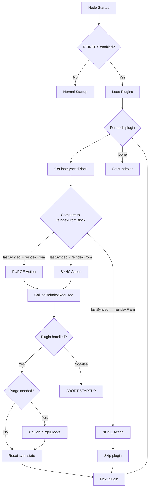

#### Reindex Actions

| Scenario                              | Action | Plugin Behavior                                             |
|---------------------------------------|--------|-------------------------------------------------------------|
| `lastSyncedBlock > reindexFromBlock`  | PURGE  | Delete data for blocks > reindexFromBlock, reset sync state |
| `lastSyncedBlock < reindexFromBlock`  | SYNC   | Sync up to reindexFromBlock before normal operation         |
| `lastSyncedBlock == reindexFromBlock` | NONE   | No action required                                          |

#### Reindex Sequence

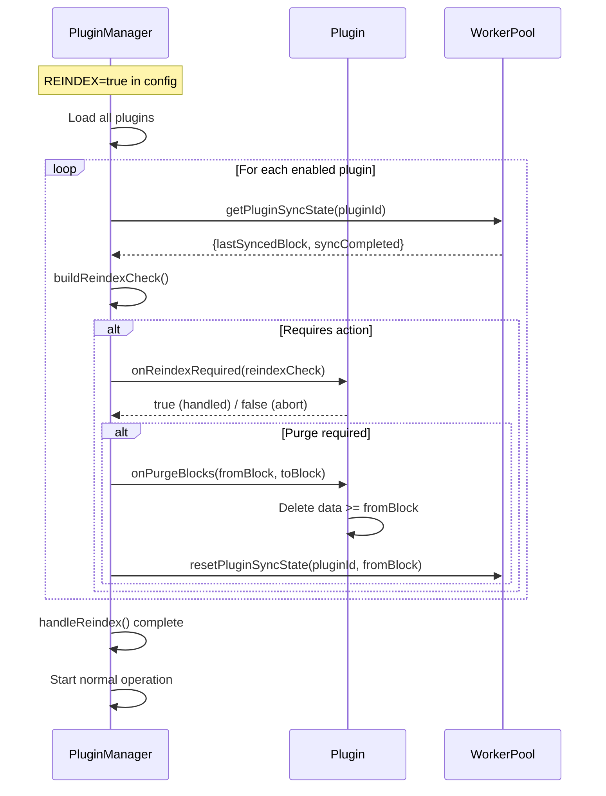

#### Plugin Implementation Example

```typescript
class MyPlugin implements IPlugin {
    async onReindexRequired(check: IReindexCheck): Promise<boolean> {
        this.logger.info(`Reindex required: ${check.action}`);

        if (check.action === ReindexAction.PURGE) {
            // Plugin can handle purge itself here, or let onPurgeBlocks handle it
            return true; // Signal we can handle this
        }

        if (check.action === ReindexAction.SYNC) {
            // Will sync via onSyncBlock after reindex handling
            return true;
        }

        return true;
    }

    async onPurgeBlocks(fromBlock: bigint, toBlock?: bigint): Promise<void> {
        // Delete all data for blocks >= fromBlock
        await this.db.collection('myData').deleteMany({
            blockHeight: {$gte: fromBlock}
        });
        this.logger.info(`Purged data from block ${fromBlock}`);
    }
}
```

### 19. Directory Structure

```
plugins/
├── my-plugin.opnet           # Enabled plugin binary
├── my-plugin.opnet.disabled  # Disabled plugin (not loaded)
├── another-plugin.opnet
└── my-plugin/                # Plugin data directory (auto-created)
    ├── config.json           # Plugin configuration
    ├── data/                 # Plugin data files
    ├── logs/                 # Plugin logs
    └── crashreports/         # Crash reports (auto-created on errors)
        └── crash-2025-12-15T05-50-00-000Z.log
```

### 20. Crash Reporting

When a plugin encounters an error during hook execution, the system:

1. Sends a crash notification to the main thread
2. Writes a detailed crash report to `plugins/{plugin-id}/crashreports/`

**ALL errors in hook execution trigger crash reports** - any hook failure is considered significant.

#### Crash Report Contents

```
=== PLUGIN CRASH REPORT ===
Timestamp: 2025-12-15T05:50:00.000Z
Plugin ID: my-plugin
Plugin Version: 1.0.0
Error Code: HOOK_CRASH

=== ERROR MESSAGE ===
TypeError: Cannot read properties of undefined

=== STACK TRACE ===
TypeError: Cannot read properties of undefined
    at MyPlugin.onBlockChange (/plugins/my-plugin/index.jsc:123:45)
    ...

=== PLUGIN STATE ===
Enabled: true
Network: mainnet
Chain ID: 1
Current Block Height: 850000
Last Synced Block: 849999
Sync Completed: true

=== END CRASH REPORT ===
```

#### Crash Report Lifecycle

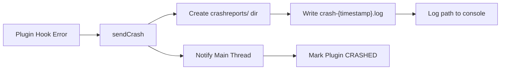

Crash reports are preserved across plugin reloads and node restarts for debugging purposes.

### 21. Chain Reorg Handling

When a blockchain reorganization occurs, the sequence is **critical**:

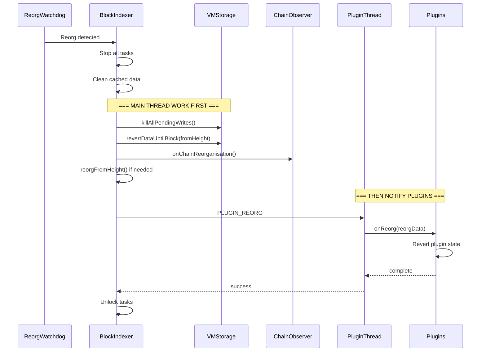

**CRITICAL**: The main thread MUST complete all its reorg operations BEFORE notifying plugins. This ensures plugins see
a consistent database state when they process the reorg. The plugin notification happens AFTER:

1. All indexing tasks are stopped
2. Pending database writes are killed
3. Block data is reverted
4. Chain observer is updated
5. Reorg is recorded (if applicable)

Only after all main thread work is complete are plugins notified via `onReorg()`.

## Rationale

### Why MLDSA Signatures?

OPNet already uses MLDSA (ML-DSA) for post-quantum resistance in epoch mining and transaction signing. Using the same
cryptographic primitive for plugins:

- Leverages existing `@btc-vision/transaction` infrastructure
- Provides quantum-resistant security guarantees
- Maintains consistency across the codebase

### Why Worker Threads?

Worker threads provide:

- Crash isolation (plugin crash doesn't take down the node)
- Parallel execution without blocking main thread
- Separate memory heaps per worker
- Clean shutdown semantics

Note: Worker threads do NOT provide security sandboxing. Plugins have full Node.js access within their worker. Security
comes from MLDSA signature verification (trusting the plugin author).

### Why Bytenode?

Bytenode compiles TypeScript/JavaScript to V8 bytecode:

- Source code protection (not decompilable)
- Faster startup (no parsing/compilation)
- Same runtime semantics as original code
- Mature tooling and documentation

### Why Permission System?

Explicit permissions provide:

- Defense in depth (principle of least privilege)
- Clear audit trail of plugin capabilities
- User confidence in plugin behavior
- Runtime enforcement of declared intentions

## Backwards Compatibility

This OIP introduces a new feature with no impact on existing functionality:

- Plugin system is opt-in (disabled if no plugins directory)
- Core APIs unchanged
- Existing configuration files unaffected
- No database schema changes to existing collections

## Security Considerations

### Signature Verification

- Plugins MUST be verified before loading
- Invalid signatures MUST cause load failure
- Public key hash in metadata allows trust-on-first-use model

### Execution Model

- Plugins run in worker threads for crash isolation and parallelism
- Bytenode provides source code protection (not security sandboxing)
- Plugins have full Node.js access within their worker thread
- Security relies on MLDSA signatures (trust the plugin author)

### Resource Limits

- Memory limits enforced via V8 heap limits
- CPU limits via worker thread priority
- Timeout enforcement on all plugin calls
- Database size limits per plugin

### Permission Enforcement

- Permissions checked at plugin load time
- Node exposes only permitted APIs to each plugin
- Unauthorized API calls throw `PluginPermissionError`
- Permission escalation not possible without re-signing

### Crash Isolation

- Plugin crashes do not affect node operation
- Crashed plugins automatically disabled
- Manual intervention required to re-enable
- Full error logging for debugging

## Reference Implementation

Implementation located in `src/src/plugins/`.

## Copyright

This OIP is licensed under the Apache-2.0 License.
