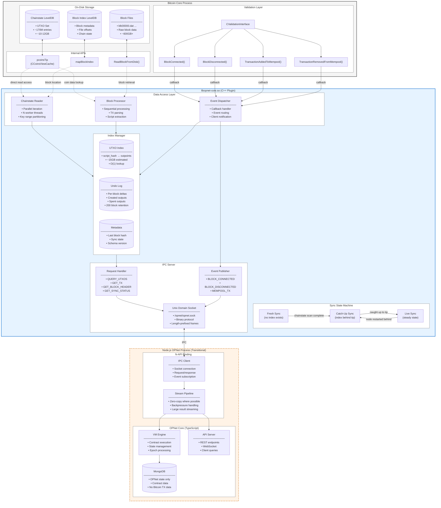

# OIP-0004: Bitcoin Core Native Plugin Protocol

```
OIP: 0004
Title: Bitcoin Core Native Plugin Protocol
Author: BlobMaster41
Type: Standards Track (Application Layer)
Status: Draft
Type: Standards Track
Created: 2026-01-12
License: Apache-2.0
Requires:
Replaces: UTXO Indexing via JSON-RPC, Block Notification via HTTP Polling, Data Duplication
```

## Table of Contents

- [1. Abstract](#1-abstract)
- [2. Plugin System Vision](#2-plugin-system-vision)
    - [2.1 Opening Bitcoin to Extensibility](#21-opening-bitcoin-to-extensibility)
    - [2.2 Consensus Layers (as defined by OPNet)](#22-consensus-layers-as-defined-by-opnet)
    - [2.3 What Plugins Enable](#23-what-plugins-enable)
    - [2.4 Design Principles](#24-design-principles)
    - [2.5 Path to BIP](#25-path-to-bip)
- [3. Motivation](#3-motivation)
    - [3.1 Long-Term Vision: Native Implementation](#31-long-term-vision-native-implementation)
    - [3.2 Current Bottlenecks](#32-current-bottlenecks)
- [4. Design Goals](#4-design-goals)
- [5. System Overview](#5-system-overview)
- [6. Component Architecture](#6-component-architecture)
    - [6.1 Bitcoin Core Plugin Loader](#61-bitcoin-core-plugin-loader)
    - [6.2 OPNet Core Plugin (libopnet-core)](#62-opnet-core-plugin-libopnet-core)
    - [6.3 LevelDB Index Layer](#63-leveldb-index-layer)
    - [6.4 IPC Transport Layer](#64-ipc-transport-layer)
    - [6.5 Node.js Binding Layer (Transitional)](#65-nodejs-binding-layer-transitional)
- [7. Data Structures](#7-data-structures)
    - [7.1 UTXO Index Schema](#71-utxo-index-schema)
    - [7.2 Undo Log Schema](#72-undo-log-schema)
    - [7.3 Block Processing State](#73-block-processing-state)
    - [7.4 IPC Message Format](#74-ipc-message-format)
- [8. Initialization and Sync Protocol](#8-initialization-and-sync-protocol)
    - [8.1 Fresh Sync (No Existing Index)](#81-fresh-sync-no-existing-index)
    - [8.2 Catch-Up Sync (Index Behind Tip)](#82-catch-up-sync-index-behind-tip)
    - [8.3 Live Sync (Steady State)](#83-live-sync-steady-state)
- [9. Chainstate Iteration Strategy](#9-chainstate-iteration-strategy)
    - [9.1 Parallel Reader Design](#91-parallel-reader-design)
    - [9.2 Block Buffering During Scan](#92-block-buffering-during-scan)
    - [9.3 Consistency Guarantees](#93-consistency-guarantees)
- [10. Block Processing Pipeline](#10-block-processing-pipeline)
    - [10.1 BlockConnected Handler](#101-blockconnected-handler)
    - [10.2 BlockDisconnected Handler](#102-blockdisconnected-handler)
    - [10.3 Reorg Handling and Undo Log](#103-reorg-handling-and-undo-log)
- [11. UTXO Query Path](#11-utxo-query-path)
    - [11.1 Address to Outpoints Lookup](#111-address-to-outpoints-lookup)
    - [11.2 Batch Coindata Retrieval](#112-batch-coindata-retrieval)
    - [11.3 Response Assembly](#113-response-assembly)
- [12. Memory Management](#12-memory-management)
    - [12.1 LevelDB Cache Sizing](#121-leveldb-cache-sizing)
    - [12.2 Chainstate Access Patterns](#122-chainstate-access-patterns)
    - [12.3 IPC Buffer Management](#123-ipc-buffer-management)
- [13. Concurrency Model](#13-concurrency-model)
    - [13.1 Lock Hierarchy](#131-lock-hierarchy)
    - [13.2 Thread Responsibilities](#132-thread-responsibilities)
    - [13.3 Safe Chainstate Access Windows](#133-safe-chainstate-access-windows)
- [14. Failure Modes and Recovery](#14-failure-modes-and-recovery)
    - [14.1 Crash During Initial Sync](#141-crash-during-initial-sync)
    - [14.2 Crash During Block Processing](#142-crash-during-block-processing)
    - [14.3 Index Corruption Detection](#143-index-corruption-detection)
    - [14.4 Deep Reorg Beyond Undo Depth](#144-deep-reorg-beyond-undo-depth)
- [15. Security Considerations](#15-security-considerations)

## 1. Abstract

This proposal defines a native C plugin for Bitcoin Core that provides OPNet with direct access to blockchain data, UTXO
state, and real-time block notifications without HTTP/JSON-RPC overhead. The plugin maintains an address-indexed UTXO
mapping backed by LevelDB, synchronizes with Bitcoin Core via internal validation callbacks, and exposes functionality
through Unix domain socket IPC. This architecture eliminates the primary bottlenecks in OPNet's current sync process,
reducing initial synchronization time from weeks to hours while providing sub-millisecond UTXO query latency.

This OIP also introduces a plugin loader system for Bitcoin Core, initially implemented in OPNet's Bitcoin Core fork,
with the intention of submitting a formal Bitcoin Improvement Proposal (BIP) to bring plugin support to upstream Bitcoin
Core. The plugin architecture aims to open Bitcoin Core to extensibility, enabling developers to build consensus layers,
indexers, and chain extensions without maintaining full forks.

## 2. Plugin System Vision

### 2.1 Opening Bitcoin to Extensibility

Bitcoin Core is currently a monolithic application. Developers wishing to extend its functionality must either fork the
entire codebase, use limited RPC interfaces, or build separate applications that duplicate data and processing. This
creates fragmentation, maintenance burden, and performance penalties.

The plugin system proposed here draws inspiration from successful extensibility models:

**Minecraft Server Plugins**: Minecraft's server ecosystem thrives because server operators can install plugins that
extend gameplay, add features, and modify behavior without forking the game. Plugins interact through a defined API, can
be installed/removed without recompilation, and multiple plugins can coexist. This model transformed Minecraft from a
single game into a platform supporting thousands of unique experiences.

**npm/Package Ecosystems**: Node.js demonstrated that a well-designed module system with clear interfaces enables
explosive ecosystem growth. Developers build on each other's work, share solutions, and compose functionality. Bitcoin
Core lacks this composability.

**Database Extensions**: PostgreSQL's extension system allows adding new data types, functions, and index methods
without modifying core. Extensions like PostGIS transformed PostgreSQL into a platform serving diverse use cases the
original developers never anticipated.

### 2.2 Consensus Layers (as defined by OPNet)

OPNet introduces "consensus layer" as a new architectural pattern. Traditionally, "consensus layer" means the internal
component of a blockchain that handles block agreement, like Ethereum's Beacon Chain. OPNet extends this term to mean an
external system that watches a base layer's blocks and builds its own deterministic state from them, without changing
the base layer at all.

A consensus layer is not a Layer 2. L2s typically need trust assumptions, bridges, or base chain modifications. A
consensus layer just observes, processes the same blocks everyone sees, and arrives at the same derived state through
deterministic execution. There's no bridge, no custodian, no new trust.

A consensus layer can have its own block positioning algorithms, transaction ordering, or finality rules that work
completely independent of how the base layer's miners order things. The base layer just provides data availability and
timestamping. The consensus layer interprets and orders that data however it wants. OPNet does exactly this. It
processes Bitcoin blocks but applies its own deterministic ordering that doesn't depend on Bitcoin miner decisions
beyond block inclusion.

OPNet is the first implementation of this pattern. It enables smart contracts on Bitcoin without any protocol changes.

**Security Properties of Consensus Layers**

A consensus layer inherits the parent chain's security and can only be more secure, never less. The consensus layer can
add its own finality rules on top of what the base layer already guarantees.

OPNet as an example:

- Requires ML-DSA (post-quantum signatures) for contract interactions, adding security on top of Bitcoin's ECDSA
- Uses epoch-based SHA1 mining for reward distribution, but SHA1 miners cannot influence consensus outcomes at all, they
  only compete for rewards
- Needs only ONE honest node to maintain validity since all state is deterministically derived from Bitcoin blocks
- Falls back to the parent chain's genesis block hash as the epoch miner if nobody produces a valid SHA1 pattern, so
  consensus finality never stops

Consensus layers are deterministic by nature. You could theoretically add something like Proof-of-Stake, but that
introduces new trust assumptions. OPNet has zero new trust assumptions beyond Bitcoin itself. Any node can verify the
entire OPNet state independently by processing Bitcoin blocks through OPNet's rules and will arrive at the exact same
state as every other node.

OPNet does have a Proof-of-Work component for epoch mining using SHA1, but it was designed to stay deterministic. The
PoW only determines reward distribution, not consensus state. Given the same Bitcoin blocks, every OPNet node derives
the exact same state regardless of who mined the epoch. The winning solution gets recorded in a Bitcoin transaction, so
it becomes part of the deterministic input. No reorg can ever happen on the consensus layer itself. The only way to
change OPNet state is to reorg Bitcoin, and that inherits Bitcoin's full security.

**Finality and Censorship Resistance**

If a SHA1 miner finds a higher-scoring solution than another miner, but the block containing the first solution is
already confirmed, the higher score doesn't matter. Changing it would require a Bitcoin reorg, not just submitting a
better answer later. There's no global latency race. Finality follows Bitcoin block confirmation.

OPNet transactions embed epoch submissions inside standard Bitcoin transactions. Bitcoin miners can't selectively censor
OPNet submissions without dropping the entire transaction and losing the fees. Rational miners include OPNet
transactions because they pay fees like anything else. Censorship doesn't make economic sense.

### 2.3 What Plugins Enable

The plugin system proposed in this OIP is independent of OPNet's consensus layer functionality. OPNet works today
without plugins. However, plugins make it significantly easier for developers to build consensus layers and other
observer-based systems by providing efficient, direct access to blockchain data. A plugin-capable Bitcoin Core enables:

**Custom Indexers**: Plugins can maintain specialized indexes (by address, by script type, by application-specific
criteria) updated in real-time via validation callbacks, without RPC overhead.

**Protocol Extensions**: New transaction types, covenant systems, or Layer 2 protocols can prototype and deploy as
plugins before consideration for soft-fork inclusion.

**Analytics and Monitoring**: Real-time chain analysis, anomaly detection, fee estimation improvements, and mempool
analysis can run in-process with direct data access.

**Alternative P2P Layers**: Plugins could implement additional peer-to-peer protocols for application-specific data
propagation while sharing Bitcoin Core's connection management.

### 2.4 Design Principles

The plugin system follows these principles:

**Non-Invasive to Consensus**: Plugins cannot modify consensus rules or cause Bitcoin Core to accept invalid blocks.
They are observers and indexers, not validators. The integrity of Bitcoin's consensus is inviolable.

**Minimal Core Changes**: The plugin loader adds minimal code to Bitcoin Core. Core developers should not bear
maintenance burden for plugin functionality.

**Stable API Surface**: Plugin API versioning ensures plugins written for one Bitcoin Core version continue working
across minor versions. Breaking changes require major version bumps with migration paths.

**Isolation**: Plugin crashes should not bring down Bitcoin Core. Plugins run in the same process for performance but
use defensive patterns to contain failures.

**Permissionless Innovation**: Anyone can write and distribute plugins. No approval process beyond the technical
requirements of the API.

### 2.5 Path to BIP

This OIP serves as the specification for OPNet's Bitcoin Core fork. Once the plugin system is battle-tested in
production:

1. **Documentation**: Publish complete plugin API documentation with examples
2. **Reference Plugins**: Release multiple open-source plugins demonstrating different use cases
3. **Security Audit**: Commission independent security review of plugin loader
4. **BIP Draft**: Submit formal BIP specifying plugin loader and API
5. **Community Engagement**: Present at Bitcoin conferences, gather feedback from Core developers
6. **Upstream PR**: Submit pull request to bitcoin/bitcoin with plugin support

The BIP will propose plugin support as an optional compile-time feature, allowing node operators to choose whether to
enable plugin loading.

## 3. Motivation

### 2.1 Long-Term Vision: Native Implementation

OPNet's long-term goal is to eliminate Node.js entirely from the runtime. The original TypeScript implementation was a
deliberate architectural decision: TypeScript provided memory safety, type checking, and rapid iteration during the
protocol's design phase without exposing the codebase to memory management vulnerabilities and exploitation vectors
inherent in lower-level languages. As the protocol matures and stabilizes, migrating critical paths to native C/C++
becomes both feasible and necessary for performance. This OIP represents the first phase of that migration.

### 2.2 Current Bottlenecks

OPNet's current architecture suffers from three critical performance bottlenecks:

**Initial Synchronization Time**: Processing the Bitcoin blockchain sequentially through JSON-RPC requires approximately
four weeks. Each block requires an HTTP round-trip, JSON serialization/deserialization, and V8 JavaScript execution for
parsing. The primary bottleneck is the write path: every UTXO must be written to the database individually, and the
entire transaction history must be replayed sequentially. This creates an unacceptable barrier for new node operators.

**Block Notification Latency**: The current polling mechanism checks for new blocks every five seconds. This introduces
unnecessary latency for block confirmation and wastes resources on empty polls. ZeroMQ, while available, exhibits
instability on ARM architectures and lacks customization for OPNet-specific filtering.

**Data Duplication**: OPNet currently stores complete transaction data in MongoDB despite Bitcoin Core already
maintaining this data on disk. This doubles storage requirements and creates synchronization complexity between two data
stores.

Note: OPNet's current UTXO read path is highly optimized and performs well even for wallets with extensive transaction
history. The inefficiency lies entirely in the initial sync write operations, not query performance. Additionally,
OPNet's current HTTP-based architecture is fully reorg-safe. this proposal does not address reorg handling deficiencies
but rather sync performance and notification latency.

The proposed native plugin addresses these bottlenecks by moving critical write operations into C, eliminating
serialization boundaries during sync, and leveraging Bitcoin Core's internal data structures directly.

## 4. Design Goals

**Zero Duplication**: Bitcoin transaction data remains solely in Bitcoin Core's block files and chainstate. OPNet stores
only index mappings and OPNet-specific state.

**Transparent Operation**: Node operators do not modify their Bitcoin Core workflow. The plugin loads automatically,
synchronizes in the background, and requires no manual intervention.

**Hour-Scale Initial Sync**: A new OPNet node with a fully-synced Bitcoin Core instance completes initial indexing
within hours, not weeks. This is achieved through parallel chainstate iteration and batched writes in native code.

**Preserve Existing Strengths**: OPNet's current UTXO read performance and reorg safety are retained. This proposal
optimizes the write path and notification latency without regressing query performance.

**Native Migration Path**: The plugin architecture serves as foundation for OPNet's eventual full migration away from
Node.js. The C plugin can incrementally absorb more functionality (transaction validation, contract execution) as the
protocol stabilizes.

**Reorg Safety**: The system correctly handles blockchain reorganizations up to a configurable depth without requiring
full resynchronization, maintaining parity with OPNet's current reorg handling.

**Minimal Bitcoin Core Modification**: The plugin uses only public internal APIs and validation callbacks. No consensus
code modifications required.

## 5. System Overview

The architecture consists of four layers:



**Data Flow Summary**

1. **Bitcoin Core** maintains authoritative blockchain state in chainstate (UTXO set) and block files (raw transactions)
2. **libopnet-core** registers for validation callbacks and maintains a secondary index optimized for address-based UTXO
   queries
3. **IPC Server** exposes plugin functionality via Unix domain socket with binary protocol
4. **Node.js Layer** (transitional) connects via IPC, pipes data to OPNet core with minimal transformation

Data flows unidirectionally from Bitcoin Core through the plugin to OPNet. The plugin never writes to Bitcoin Core's
data structures. All index state lives in a separate LevelDB instance managed exclusively by the plugin.

## 6. Component Architecture

### 6.1 Bitcoin Core Plugin Loader

Before describing the OPNet core plugin, we specify the plugin loader system that enables it. This loader will be
implemented in OPNet's Bitcoin Core fork and proposed as a BIP for upstream inclusion.

**Plugin Discovery**

Plugins are shared libraries located in the `<datadir>/plugins/` directory. The file extension depends on the platform:
`.so` on Linux, `.dll` on Windows. On startup, Bitcoin Core scans this directory and automatically loads all valid
plugin files for the current platform. Plugins can also be explicitly specified in bitcoin.conf:

```
# bitcoin.conf
plugin=/path/to/libopnet-core.so   # Linux
plugin=C:\path\to\opnet-core.dll   # Windows
```

The plugin loader uses platform-specific APIs internally. On Linux it uses `dlopen()`, `dlsym()`, and `dlclose()`. On
Windows it uses `LoadLibrary()`, `GetProcAddress()`, and `FreeLibrary()`. The plugin interface is identical across
platforms, only the loading mechanism differs.

**Plugin Interface (Example)**

The final plugin interface is not yet defined. Every plugin will need to export metadata and lifecycle hooks, something
like this:

```c
// Plugin metadata - called first to verify compatibility
struct PluginInfo {
    uint32_t api_version;        // Plugin API version (must match core)
    const char* name;            // Human-readable name
    const char* version;         // Plugin version string
    const char* description;     // Brief description
};
extern struct PluginInfo plugin_info;

// Lifecycle hooks
extern bool plugin_init(PluginContext* ctx);      // Called on load
extern void plugin_shutdown(PluginContext* ctx);  // Called on unload

// Optional: declare which callbacks the plugin wants
extern uint32_t plugin_capabilities;  // Bitmask of requested capabilities
```

**PluginContext Structure (Example)**

The context passed to plugins provides access to Bitcoin Core internals. The final structure is not yet defined, but it
will look something like this:

```c
struct PluginContext {
    // Version info
    uint32_t core_version;
    uint32_t api_version;
    
    // Chain state access (read-only)
    const ChainstateManager* chainstate;
    const CTxMemPool* mempool;
    const CBlockIndex* tip;
    
    // Data retrieval functions
    bool (*GetCoin)(const COutPoint* outpoint, Coin* coin);
    bool (*GetBlock)(const uint256* hash, CBlock* block);
    bool (*GetBlockIndex)(const uint256* hash, CBlockIndex** index);
    bool (*GetTransaction)(const uint256* txid, CTransactionRef* tx);
    
    // Callback registration
    bool (*RegisterValidationInterface)(CValidationInterface* iface);
    void (*UnregisterValidationInterface)(CValidationInterface* iface);
    
    // Logging
    void (*Log)(int level, const char* category, const char* message);
    
    // Configuration access
    const char* (*GetDataDir)(void);
    const char* (*GetArg)(const char* name, const char* default_value);
    int64_t (*GetIntArg)(const char* name, int64_t default_value);
    bool (*GetBoolArg)(const char* name, bool default_value);
    
    // Plugin-private storage
    void* user_data;
};
```

**Capability Flags (Example)**

Plugins will declare required capabilities. Core refuses to load plugins requesting unavailable capabilities. Example
flags:

```c
#define PLUGIN_CAP_VALIDATION_INTERFACE  (1 << 0)  // Receive block/tx callbacks
#define PLUGIN_CAP_CHAINSTATE_READ       (1 << 1)  // Read UTXO set
#define PLUGIN_CAP_MEMPOOL_READ          (1 << 2)  // Read mempool
#define PLUGIN_CAP_BLOCK_READ            (1 << 3)  // Read block data
#define PLUGIN_CAP_NET_EVENTS            (1 << 4)  // Receive P2P events
#define PLUGIN_CAP_RPC_REGISTER          (1 << 5)  // Register custom RPC methods
```

**Loading Sequence**

1. Bitcoin Core starts and completes basic initialization
2. Plugin directory gets scanned, shared libraries identified
3. For each plugin, the loader opens the shared library, locates and verifies the `plugin_info` symbol, checks
   `api_version` compatibility, checks `plugin_capabilities` against available features, then calls `plugin_init()` with
   a populated context. If init returns false, it logs an error and skips that plugin.
4. Successful plugins get added to the active plugin list
5. Bitcoin Core continues with normal startup

**Shutdown Sequence**

1. Bitcoin Core begins shutdown
2. For each active plugin in reverse load order, it calls `plugin_shutdown()` then closes the shared library
3. Bitcoin Core continues with normal shutdown

**Error Handling**

Plugin failures are isolated where possible:

- Plugin init failure: logged, plugin skipped, Core continues
- Plugin crash in callback: signal handler logs, plugin unloaded, Core continues
- Plugin hangs: watchdog thread detects, plugin forcibly unloaded

**Security Considerations**

Plugins run with full process privileges. This is a deliberate design choice:

- Sandboxing would require complex IPC, defeating performance goals
- Plugin authors are trusted, same as running any software
- Node operators choose which plugins to install
- Malicious plugins could steal wallet keys or corrupt data
- Users must only install plugins from trusted sources

This matches the security model of Minecraft plugins, VS Code extensions, and browser extensions with full permissions.

### 6.2 OPNet Core Plugin (libopnet-core)

The plugin is a shared library loaded by Bitcoin Core at startup via the `-loadplugin` mechanism or through direct
compilation into a custom Bitcoin Core build. It registers callbacks with Bitcoin Core's validation interface and spawns
background threads for index management.

**Initialization Sequence**

1. Plugin entry point called by Bitcoin Core during startup
2. Open or create OPNet index LevelDB at configured path
3. Read index metadata (last processed block hash and height)
4. Compare against Bitcoin Core's current chain tip
5. Determine sync mode (fresh, catch-up, or live)
6. Register CValidationInterface implementation
7. Start IPC server thread
8. If catch-up needed, spawn chainstate reader threads

**CValidationInterface Callbacks Implemented**

- `BlockConnected`: New block added to active chain
- `BlockDisconnected`: Block removed from active chain during reorg
- `TransactionAddedToMempool`: Unconfirmed transaction received
- `TransactionRemovedFromMempool`: Transaction dropped or confirmed

**Thread Model**

- Main thread: Bitcoin Core's event loop, callbacks execute here
- IPC thread: Handles incoming connections and dispatches requests
- Reader threads (N): Parallel chainstate iteration during initial sync
- Writer thread: Serializes index updates to LevelDB

### 6.3 LevelDB Index Layer

The plugin maintains its own LevelDB instance separate from Bitcoin Core's chainstate. This database stores two primary
structures: the UTXO index mapping addresses to outpoints, and the undo log for reorg handling.

**Database Location**: `<datadir>/opnet/index/`

**Why LevelDB**

- Already linked into Bitcoin Core, no additional dependencies
- Proven performance characteristics for blockchain workloads
- Supports concurrent reads with single writer
- Crash-safe with write-ahead logging

**Key Prefixes**

- `u` - UTXO index entries
- `r` - Undo log entries
- `m` - Metadata (sync state, version)

### 6.4 IPC Transport Layer

Communication between the plugin and OPNet uses Unix domain sockets for lowest possible latency on the same machine. The
socket provides bidirectional communication: OPNet sends queries, the plugin sends responses and event notifications.

**Socket Path**: `<datadir>/opnet/opnet.sock`

**Connection Model**: Single persistent connection from OPNet to the plugin. Reconnection handled automatically on
disconnect.

**Message Framing**: Length-prefixed binary messages. Four-byte little-endian length header followed by message payload.
No JSON, no text encoding.

**Flow Control**: Request-response for queries. Server-initiated push for block notifications. Sequence numbers
correlate responses with requests.

### 6.5 Node.js Binding Layer (Transitional)

A thin N-API module provides the JavaScript interface during the transition period. This module does not parse or
transform data beyond what is necessary for the V8 boundary crossing. As OPNet migrates toward a fully native
implementation, this layer will be deprecated and replaced with direct C API calls.

**Responsibilities**

- Establish and maintain socket connection
- Send query requests, receive responses
- Expose async/await interface to OPNet
- Stream large result sets without buffering entire response
- Emit events for block notifications

**Non-Responsibilities**

- Transaction parsing (done in C)
- UTXO filtering (done in C)
- Address derivation (done in C)
- Any cryptographic operations

**Deprecation Path**

As OPNet's core components migrate to native code, the N-API binding layer will be replaced by direct linkage to
libopnet-core. The IPC protocol remains stable regardless of client implementation language, allowing gradual migration
without breaking changes.

## 7. Data Structures

### 7.1 UTXO Index Schema

The index maps script hashes to sets of outpoints. Using script hash rather than address provides uniformity across all
output types (P2PKH, P2SH, P2WPKH, P2WSH, P2TR).

**Key Format**

```
Prefix (1 byte): 'u' (0x75)
Script Hash (32 bytes): SHA256(scriptPubKey)
```

**Value Format**

```
Count (4 bytes): Number of outpoints, little-endian uint32
Outpoints (36 bytes each):
  - TXID (32 bytes): Transaction hash, internal byte order
  - Vout (4 bytes): Output index, little-endian uint32
```

**Example**

For a P2WPKH address with three unspent outputs:

```
Key: 75 || SHA256(0014<20-byte-pubkey-hash>)
Value: 03000000 || <txid1><vout1> || <txid2><vout2> || <txid3><vout3>
```

**Design Rationale**

- Script hash provides fixed 32-byte keys regardless of script type
- Storing multiple outpoints per key reduces key overhead
- No coin data stored. retrieved from chainstate on demand
- Insertion order within value preserves rough temporal ordering

### 7.2 Undo Log Schema

The undo log stores sufficient information to reverse index changes during blockchain reorganizations.

**Key Format**

```
Prefix (1 byte): 'r' (0x72)
Block Height (4 bytes): Little-endian uint32
```

**Value Format**

```
Block Hash (32 bytes): Hash of this block
Created Count (4 bytes): Number of outputs created
Created Entries (variable):
  - Script Hash (32 bytes)
  - TXID (32 bytes)
  - Vout (4 bytes)
Spent Count (4 bytes): Number of outputs spent
Spent Entries (68 bytes each):
  - Script Hash (32 bytes)
  - TXID (32 bytes)
  - Vout (4 bytes)
```

**Retention Policy**

Undo entries are kept for a configurable number of blocks (default: 200). On each new block, entries older than the
retention depth are pruned. This bounds storage growth while supporting reorgs deeper than any observed in Bitcoin's
history.

### 7.3 Block Processing State

**Metadata Key**: `m:state`

**Value Format**

```
Version (4 bytes): Schema version, currently 1
Last Block Hash (32 bytes): Hash of last processed block
Last Block Height (4 bytes): Height of last processed block
Index Complete (1 byte): 0 if initial sync in progress, 1 if complete
Chainstate Snapshot Height (4 bytes): Height when chainstate scan started
```

**Purpose**

On startup, the plugin reads this metadata to determine sync state. If `Index Complete` is 0, initial sync was
interrupted and must resume. If the `Last Block Hash` is not in the active chain, a reorg occurred while offline and
catch-up must account for this.

### 7.4 IPC Message Format

All messages use a binary format with no text encoding. Multi-byte integers are little-endian.

**Request Header**

```
Length (4 bytes): Total message length excluding this field
Type (1 byte): Request type identifier
Sequence (4 bytes): Client-assigned sequence number for correlation
```

**Request Types (Example)**

| Type | Name                  | Description                  |
|------|-----------------------|------------------------------|
| 0x01 | QUERY_UTXOS           | Get UTXOs for script hash    |
| 0x02 | QUERY_UTXOS_PAGINATED | Get UTXOs with offset/limit  |
| 0x03 | GET_SYNC_STATUS       | Get index sync state         |
| 0x04 | SUBSCRIBE_BLOCKS      | Enable block notifications   |
| 0x05 | UNSUBSCRIBE_BLOCKS    | Disable block notifications  |
| 0x06 | GET_BLOCK_TXIDS       | Get transaction IDs in block |
| 0x07 | GET_TX                | Get raw transaction by TXID  |
| 0x08 | GET_BLOCK_HEADER      | Get block header by hash     |

**Response Header**

```
Length (4 bytes): Total message length excluding this field
Type (1 byte): Response type (0x80 | request type) or event type
Sequence (4 bytes): Echoed from request, or 0 for events
Status (1 byte): 0 = success, non-zero = error code
```

**Event Types (Example)**:

| Type | Name               | Description             |
|------|--------------------|-------------------------|
| 0xE1 | BLOCK_CONNECTED    | New block added         |
| 0xE2 | BLOCK_DISCONNECTED | Block removed (reorg)   |
| 0xE3 | MEMPOOL_TX         | New mempool transaction |

**QUERY_UTXOS Request Payload**

```
Script Hash (32 bytes): SHA256 of scriptPubKey
Max Results (4 bytes): Maximum UTXOs to return, 0 = no limit
Include Coindata (1 byte): 1 = include amount/script, 0 = outpoints only
```

**QUERY_UTXOS Response Payload**

```
Total Count (4 bytes): Total UTXOs for this script hash
Returned Count (4 bytes): Number in this response
Has More (1 byte): 1 if more results available
UTXOs (variable):
  Per UTXO:
    - TXID (32 bytes)
    - Vout (4 bytes)
    - If Include Coindata:
      - Amount (8 bytes)
      - Height (4 bytes)
      - Coinbase (1 byte)
      - Script Length (2 bytes)
      - Script (variable)
```

**BLOCK_CONNECTED Event Payload**

```
Block Hash (32 bytes)
Block Height (4 bytes)
Previous Hash (32 bytes)
Timestamp (4 bytes)
Transaction Count (4 bytes)
OPNet TX Count (4 bytes): Transactions matching OPNet criteria
OPNet TXIDs (32 bytes each): Only OPNet-relevant transactions
```

## 8. Initialization and Sync Protocol

### 8.1 Fresh Sync (No Existing Index)

When the plugin finds no existing index database or metadata, it performs a full chainstate scan.

**Sequence**

1. Create index database at configured path
2. Write initial metadata with `Index Complete = 0`
3. Record Bitcoin Core's current chain tip as target
4. Register BlockConnected callback, buffer incoming blocks
5. Spawn N reader threads (N = CPU cores - 2, minimum 2)
6. Each reader iterates assigned portion of chainstate keyspace
7. For each UTXO entry:
    - Extract scriptPubKey
    - Compute script hash
    - Queue (script_hash, outpoint) pair for index writer
8. Writer thread batches updates, writes to index LevelDB
9. When all readers complete, record chainstate snapshot height
10. Process buffered blocks from snapshot height to current tip
11. Set `Index Complete = 1`, record final block hash/height
12. Enter live sync mode

**Parallelization Strategy**

LevelDB keyspace is divided by key prefix. Since chainstate keys start with `C` followed by TXID bytes, distribution is
roughly uniform. Each reader is assigned a TXID prefix range (e.g., reader 0 handles 0x00-0x3F, reader 1 handles
0x40-0x7F, etc.).

**Memory Bounds**

Readers do not load all UTXOs into memory. Each reader maintains a small buffer of pending index updates. When buffer
reaches threshold (e.g., 10,000 entries), reader blocks until writer drains it. This bounds memory regardless of UTXO
set size.

### 8.2 Catch-Up Sync (Index Behind Tip)

When the plugin finds an existing index but the recorded block is behind Bitcoin Core's tip, catch-up is needed.

**Sequence**

1. Load metadata, get last processed block hash and height
2. Verify last processed block is in active chain (not orphaned)
3. If orphaned, walk back through undo log until finding common ancestor
4. Determine blocks needed: from last processed height + 1 to current tip
5. For each block in sequence:
    - Read block from disk via Bitcoin Core's ReadBlockFromDisk
    - Process as if received via BlockConnected
    - Update index and undo log
6. Update metadata with new tip

**Orphaned Block Handling**

If the last processed block is no longer in the active chain, a reorg occurred while the node was offline. The plugin
must roll back to the fork point:

1. Load undo entry for last processed height
2. Verify block hash matches. if not, index is corrupt
3. Apply undo operations (reverse of BlockConnected)
4. Decrement height, repeat until finding block in active chain
5. Resume forward sync from that point

### 8.3 Live Sync (Steady State)

Once caught up, the plugin enters live mode where all updates come via validation callbacks.

**BlockConnected Flow**

1. Callback fires on Bitcoin Core's main thread
2. Block data already in memory (passed to callback)
3. Process block synchronously (details in Section 9)
4. Update metadata with new tip
5. Push BLOCK_CONNECTED event to IPC clients
6. Return from callback

**Latency Target**

Block processing must complete fast enough to not delay Bitcoin Core's validation pipeline. Target: under 100ms for
typical blocks. Blocks with unusual characteristics (very large, many outputs) may take longer but should remain under 1
second.

## 9. Chainstate Iteration Strategy

### 9.1 Parallel Reader Design

The chainstate contains approximately 170 million UTXO entries. Sequential iteration would take 30+ minutes on typical
hardware. Parallel iteration reduces this proportionally to available cores.

**Reader Thread Implementation**

Each reader creates its own LevelDB iterator with a defined key range:

```
Start Key: 'C' || <range_start_byte> || 0x00 (repeated)
End Key: 'C' || <range_end_byte> || 0xFF (repeated)
```

The iterator seeks to start key and advances until reaching end key or database end.

**Key Parsing**

Chainstate keys after the 'C' prefix contain:

- TXID (32 bytes, internal byte order)
- Varint-encoded vout index

**Value Parsing**

Chainstate values contain compressed UTXO data:

- Varint: code encoding height and coinbase flag
- Varint: compressed amount
- Compressed script (type byte + data)

The plugin reuses Bitcoin Core's decompression functions rather than reimplementing. This requires linking against
Bitcoin Core's internal libraries or accessing via exposed symbols.

**Output**

For each parsed entry, reader produces:

- Script hash (computed from decompressed scriptPubKey)
- Outpoint (TXID + vout)

These pairs are queued for the writer thread.

### 9.2 Block Buffering During Scan

While chainstate iteration runs, new blocks may arrive. These must be captured and processed after the scan completes.

**Buffer Implementation**

- Fixed-size ring buffer in memory
- Holds block data (not just notifications)
- Sized for expected scan duration plus safety margin (e.g., 100 blocks)
- If buffer fills, scan must pause until space available

**BlockConnected During Scan**

1. Check if initial sync in progress
2. If yes, copy block data to buffer, return immediately
3. Do not update index (would conflict with scan)

**Post-Scan Processing**

1. Record chainstate snapshot height (the chain tip when scan began)
2. Drain buffer, processing each block sequentially
3. For blocks at or below snapshot height, skip (already in chainstate)
4. For blocks above snapshot height, process normally
5. Clear buffer, switch to live mode

### 9.3 Consistency Guarantees

**Concern**: Chainstate may change during scan. A UTXO could be spent between when we read it and when scan completes.

**Resolution**: This is acceptable. The buffered blocks will process the spend, removing the UTXO from our index.
Temporary inconsistency during scan is fine. final state is correct.

**Concern**: A UTXO could be created and spent entirely during scan, never appearing in our index.

**Resolution**: Also acceptable. If it's spent, it's not unspent, so it correctly doesn't appear in the UTXO index.

**Concern**: Scan reads UTXO, then it's spent, then scan completes, but the spending block arrived before scan started
and isn't in buffer.

**Resolution**: Cannot happen. If spending block arrived before scan started, the UTXO wouldn't be in chainstate when we
read it. If it arrived after scan started, it's in the buffer.

## 10. Block Processing Pipeline

### 10.1 BlockConnected Handler

When a new block connects to the active chain, the following processing occurs:

**Input**

- CBlock pointer (full block data)
- CBlockIndex pointer (block metadata)
- Block height

**Step 1 - Initialize Undo Entry**

Create empty undo entry for this block height with block hash.

**Step 2 - Process Each Transaction**

For each transaction in block:

For each output (vout index 0 to n):

1. Extract scriptPubKey
2. Compute script hash: SHA256(scriptPubKey)
3. Add (script_hash, txid, vout) to "created" list
4. Queue index addition

For each input (skip coinbase):

1. Get spent outpoint (prevout txid and vout)
2. Look up script hash from index (reverse lookup needed)
3. If not found in index, UTXO was created before index existed. fetch from chainstate
4. Add (script_hash, txid, vout, amount, script) to "spent" list
5. Queue index removal

**Step 3 - Apply Index Updates**

Batch all additions and removals into single LevelDB write batch. Execute atomically.

**Step 4 - Write Undo Entry**

Serialize undo entry, write to undo log.

**Step 5 - Update Metadata**

Update last block hash and height.

**Step 6 - Notify Clients**

Push BLOCK_CONNECTED event via IPC.

**Reverse Lookup Challenge**

The index maps script_hash → outpoints. To process a spend, we have the outpoint but need the script_hash to update the
index.

**Solutions**

A. Maintain reverse index: outpoint → script_hash

- Doubles index size
- Enables O(1) lookup

B. Fetch from chainstate before it's removed

- Bitcoin Core hasn't removed it yet when callback fires
- Access pcoinsTip with the outpoint, get script, compute hash
- No additional storage required

Option B is preferred. The spent UTXO is still in chainstate when BlockConnected fires. Bitcoin Core removes it after
all callbacks complete.

### 10.2 BlockDisconnected Handler

When a block is disconnected during reorganization:

**Input**

- CBlock pointer
- CBlockIndex pointer
- Block height

**Step 1 - Load Undo Entry**

Read undo entry for this block height. Verify block hash matches.

**Step 2 - Reverse Created Outputs**

For each entry in "created" list:

1. Remove (script_hash, outpoint) from index

**Step 3 - Restore Spent Outputs**

For each entry in "spent" list:

1. Add (script_hash, outpoint) back to index
2. Spent coindata available in undo entry if needed

**Step 4 - Delete Undo Entry**

Remove the undo entry for this height.

**Step 5 - Update Metadata**

Decrement last block height. Update hash to previous block.

**Step 6 - Notify Clients**

Push BLOCK_DISCONNECTED event via IPC.

### 10.3 Reorg Handling and Undo Log

**Reorg Sequence**

1. Bitcoin Core detects longer chain
2. Disconnects blocks from current tip back to fork point
3. Connects blocks from fork point to new tip
4. Each disconnect/connect triggers respective callback

**Plugin Behavior**

Plugin processes each callback independently. No special reorg detection needed. The sequence of BlockDisconnected
followed by BlockConnected naturally produces correct final state.

**Undo Log Pruning**

After processing BlockConnected, prune undo entries older than retention depth:

```
Current Height: H
Retention Depth: D (default 200)
Prune: All entries where height < H - D
```

**Deep Reorg Recovery**

If a reorg exceeds retention depth, undo data is unavailable. The plugin must:

1. Detect missing undo entry when BlockDisconnected requests it
2. Mark index as corrupt/incomplete
3. Trigger full resync from chainstate
4. This is acceptable because reorgs deeper than 200 blocks are extraordinary events

## 11. UTXO Query Path

### 11.1 Address to Outpoints Lookup

**Input**: Script hash (32 bytes)

**Process**

1. Construct key: 'u' || script_hash
2. LevelDB Get(key)
3. If not found, return empty result
4. Parse value: extract count and outpoint array

**Performance**

Single LevelDB read. With default block cache, hot keys return in microseconds. Cold keys require disk seek, typically
under 1ms on SSD.

### 11.2 Batch Coindata Retrieval

When client requests UTXO data (amounts, scripts), outpoints must be resolved against chainstate.

**Input**: Array of outpoints from index lookup

**Process**

1. Acquire read access to chainstate (respect lock hierarchy)
2. For each outpoint:
    - Call pcoinsTip->GetCoin(outpoint, coin)
    - If found, extract amount, height, coinbase flag, script
    - If not found, UTXO was spent (index stale, concurrent block)
3. Release chainstate access
4. Filter out missing (spent) UTXOs from result
5. Optionally: remove stale outpoints from index

**Batching Strategy**

Rather than acquiring/releasing lock per UTXO, acquire once for entire batch. 2000 UTXO lookups with single lock
acquisition completes in low milliseconds.

**Staleness Handling**

Between index lookup and chainstate query, a block may arrive spending some UTXOs. The GetCoin call returns empty for
these. They're filtered from results and lazily removed from index.

### 11.3 Response Assembly

**Output Format**

Structured binary response per IPC message format.

**Streaming**

For very large result sets (wallets with millions of UTXOs), response is chunked:

1. First response includes total count and first N results
2. Client requests next page with offset
3. Repeat until all results delivered

**Pagination State**

Server is stateless. Client provides offset on each request. Index may change between pages (new block), so results may
shift slightly. This is acceptable. client sees eventually-consistent view.

## 12. Memory Management

### 12.1 LevelDB Cache Sizing

The plugin's index LevelDB uses separate cache from Bitcoin Core's chainstate.

**Recommended Configuration**

- Block cache: 256MB (holds recently accessed index blocks)
- Write buffer: 64MB (batches writes before flush)

**Rationale**

UTXO index is much smaller than chainstate. 170 million script hashes with average 2 outpoints each:

- Keys: 33 bytes × 170M ≈ 5.6GB
- Values: average 76 bytes × 170M ≈ 12.9GB
- Total: ~18GB on disk after compression (~8-10GB typical)

256MB cache holds ~3% of index, sufficient for hot-set caching.

### 12.2 Chainstate Access Patterns

Plugin accesses Bitcoin Core's chainstate for:

- Initial sync (full iteration)
- Coindata retrieval (point lookups)
- Reverse script lookup during block processing

**During Initial Sync**

Chainstate access is sequential iteration. This pollutes Bitcoin Core's LevelDB cache but scan completes relatively
quickly. Cache warms again during normal operation.

**During Live Operation**

Point lookups for coindata retrieval. Access pattern depends on query distribution. Popular addresses (exchanges, etc.)
naturally stay cached.

### 12.3 IPC Buffer Management

**Socket Buffers**

Unix domain sockets have kernel-managed buffers. Default sizes (typically 128KB-256KB) are sufficient for most messages.

**Large Response Handling**

Responses exceeding socket buffer trigger backpressure. Writer blocks until reader drains buffer. This prevents
unbounded memory growth for large query results.

**Event Queue**

Block notifications queue in memory if client is slow to consume. Queue is bounded (e.g., 1000 events). If exceeded,
oldest events dropped and client notified of gap. Client must catch up via explicit sync.

## 13. Concurrency Model

### 13.1 Lock Hierarchy

Multiple locks coordinate access across components:

**Bitcoin Core Locks** (external, respect existing hierarchy):

- cs_main: Global chain state lock
- Chainstate's internal LevelDB lock

**Plugin Locks**

- index_mutex: Protects index LevelDB writes
- undo_mutex: Protects undo log writes
- state_mutex: Protects sync state and metadata
- ipc_mutex: Protects IPC client list and event queue

**Hierarchy** (acquire in this order to prevent deadlock):

1. cs_main (when needed for chainstate access)
2. state_mutex
3. index_mutex
4. undo_mutex
5. ipc_mutex

**Lock-Free Paths**

Index reads (LevelDB Get) don't require plugin locks. LevelDB handles concurrent read/write internally. This allows high
query throughput during block processing.

### 13.2 Thread Responsibilities

**Bitcoin Core Main Thread**

- Calls validation callbacks
- BlockConnected/BlockDisconnected execute here
- Must return quickly to not block validation

**Plugin Writer Thread**

- Receives index update batches from main thread
- Executes LevelDB writes
- Main thread doesn't wait for write completion (async handoff)

**Plugin IPC Thread**

- Accepts client connections
- Reads requests, dispatches to handler
- Sends responses and events

**Plugin Reader Threads** (initial sync only):

- Iterate assigned chainstate key range
- Queue results for writer thread
- Terminate after scan completes

### 13.3 Safe Chainstate Access Windows

**Problem**: Chainstate is modified during block processing. When is it safe to read?

**Analysis**

- BlockConnected callback fires AFTER chainstate is updated with new block
- BlockDisconnected callback fires AFTER chainstate is rolled back
- Between callbacks, chainstate is stable

**Safe Access**

- During callback execution: safe, chainstate reflects post-update state
- Between blocks: safe, no modifications in progress
- During validation (before callback): NOT safe, intermediate state

**Query Handling**

IPC queries may arrive at any time. If query arrives during callback execution (same process, different thread),
chainstate access is safe. The callback holds cs_main, but LevelDB allows concurrent reads.

**Recommended Pattern**

For coindata retrieval, don't acquire cs_main. Just call GetCoin. LevelDB's snapshot isolation provides consistent read
even if concurrent write occurs. Worst case: read slightly stale data, which is acceptable for UTXO queries.

## 14. Failure Modes and Recovery

### 14.1 Crash During Initial Sync

**Detection**

On startup, metadata shows `Index Complete = 0`.

**Recovery**

1. Delete partial index database
2. Restart fresh sync from beginning

**Alternative** (resumable sync):

Track progress more granularly:

- Record completed key ranges
- On restart, resume from last incomplete range
- More complex but avoids repeating hours of work

Recommendation: Implement simple approach first. Add resumability if users report issues.

### 14.2 Crash During Block Processing

**Detection**

Metadata block height doesn't match index state, or LevelDB detects incomplete write.

**Recovery**

1. LevelDB recovers from write-ahead log automatically
2. Verify metadata consistency
3. If inconsistent, roll back to last known good state using undo log
4. If undo log also inconsistent, trigger full resync

**Write Ordering**

To ensure recoverability:

1. Write index updates (atomic batch)
2. Write undo entry
3. Update metadata

If crash after step 1 but before step 3, metadata is stale. On recovery, undo log can roll back step 1.

### 14.3 Index Corruption Detection

**Symptoms**

- LevelDB reports errors
- Index lookup returns data inconsistent with chainstate
- Undo application fails due to missing entries

**Detection Methods**

- LevelDB's built-in checksums catch storage corruption
- Periodic consistency checks (background thread samples index entries, verifies against chainstate)

**Recovery**

- Minor corruption: attempt repair via LevelDB's RepairDB
- Major corruption: delete index, full resync

### 14.4 Deep Reorg Beyond Undo Depth

**Trigger**

BlockDisconnected requests undo entry for height that was pruned.

**Response**

1. Log error with details
2. Mark index as requiring resync
3. Notify connected clients of index unavailability
4. Trigger background resync
5. During resync, queries return error or stale data with warning

**Prevention**

Default undo depth of 200 blocks exceeds any observed Bitcoin reorg. Configure higher if running on testnet or other
chains with different characteristics.

## 15. Security Considerations

**No Consensus Impact**

The plugin is read-only with respect to Bitcoin Core's validation. It cannot cause invalid blocks to be accepted or
valid blocks to be rejected. Bugs in the plugin affect only OPNet's view of chain state, not Bitcoin's consensus.

**Denial of Service**

Malicious IPC client could flood queries. Mitigation:

- Rate limiting per connection
- Maximum concurrent connections
- Query complexity limits (max results per query)

**Data Integrity**

Index reflects plugin's interpretation of blockchain. Bugs could cause incorrect UTXO data. Mitigation:

- Extensive testing against known blockchain states
- Consistency checks comparing index against chainstate
- Clear documentation that index is derived data, not authoritative

**Privilege Separation**

Plugin runs in same process as Bitcoin Core with same privileges. No additional attack surface beyond what Bitcoin Core
already has. IPC socket should be protected by filesystem permissions (owner-only access).

**Memory Safety**

Plugin is implemented in C/C++, same as Bitcoin Core. Memory safety bugs possible. Mitigation:

- Use Bitcoin Core's existing memory management patterns
- Extensive testing with sanitizers (ASan, MSan)
- Fuzzing of input parsing code

## Copyright

This document is licensed under Apache-2.0.
