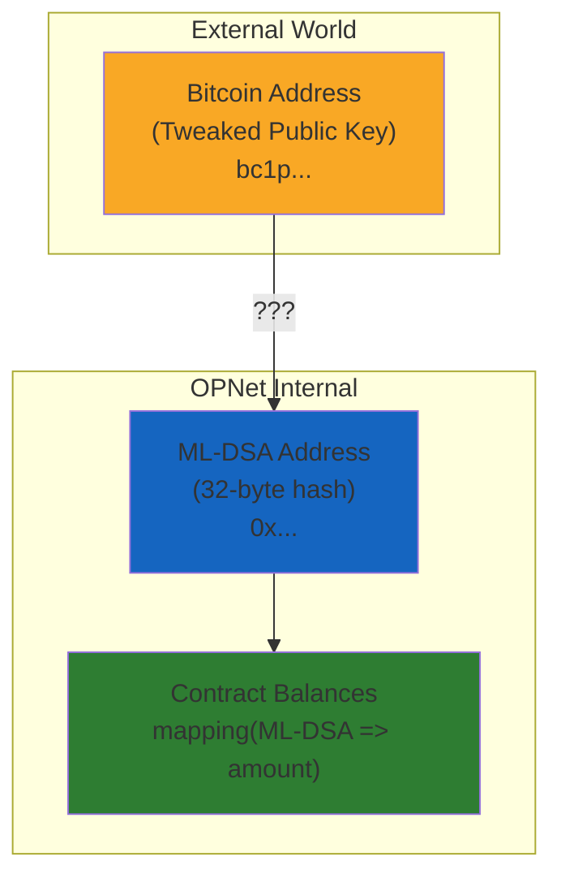
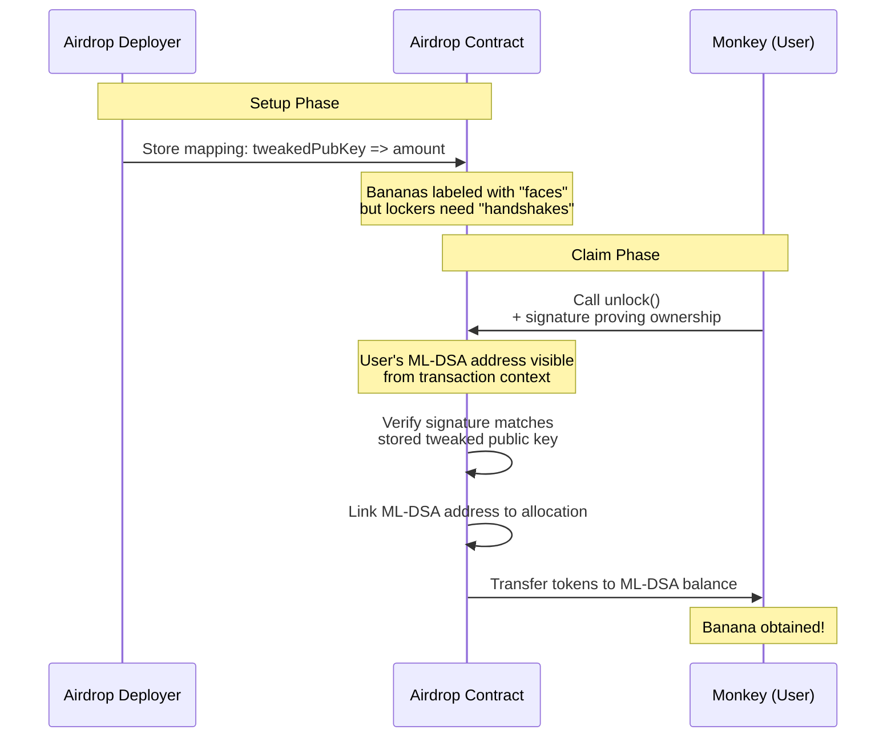
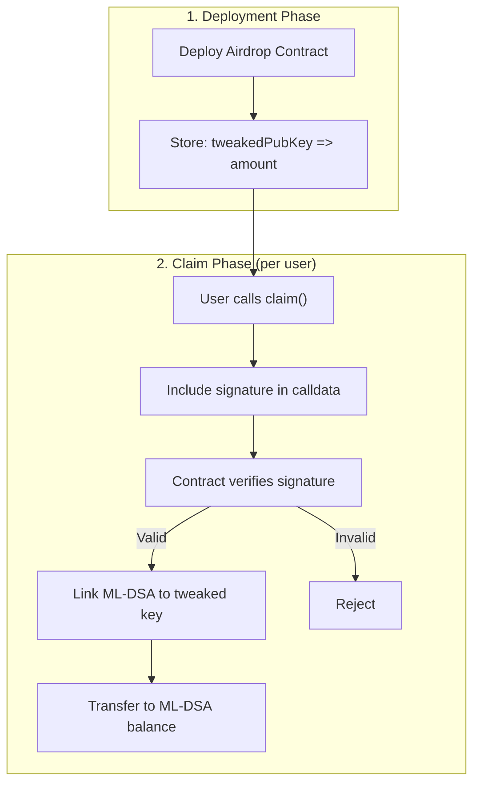
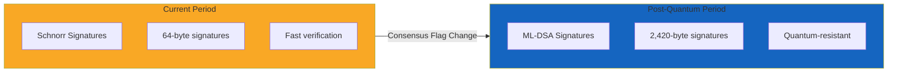

# Understanding OPNet's Two Address Systems: The Airdrop Pattern

## Table of Contents
- [The Critical Distinction](#the-critical-distinction)
- [The Banana Locker Analogy](#the-banana-locker-analogy)
- [Why You Cannot Directly Airdrop to Bitcoin Addresses](#why-you-cannot-directly-airdrop-to-bitcoin-addresses)
- [Solution 1: Signature Verification in Contracts](#solution-1-signature-verification-in-contracts)
- [Solution 2: Pre-Converting Keys](#solution-2-pre-converting-keys)
- [Implementation Examples](#implementation-examples)
- [Frontend Integration](#frontend-integration)
- [Backend Integration](#backend-integration)

## The Critical Distinction

OPNet operates with **two fundamentally different address systems** that must be understood before building any token distribution mechanism:

| Address System | Format | Used For | Example |
|---------------|--------|----------|---------|
| **Bitcoin Address** | Taproot P2TR (tweaked public key) | External identity, Bitcoin transactions | `bc1p...` |
| **OPNet Address** | ML-DSA public key hash (32 bytes) | Contract balances, internal state | `0x...` (64 hex chars) |

**The core problem:** Contract balances in OPNet are keyed by **ML-DSA addresses**, but external users are typically known only by their **Bitcoin addresses**. These two address types have no inherent link until the user explicitly creates one.



## The Banana Locker Analogy

Imagine a locked banana locker system:

**The Setup:**
- You know 300 monkeys by their **face** (this is their Bitcoin address - the tweaked public key)
- You want to give each monkey a banana
- You write on each locker "this banana belongs to the monkey with this face" and put a banana inside

**The Problem:**
- The locker system doesn't open with faces
- It opens with a **secret handshake** that only each monkey knows (this is their ML-DSA key)
- You have no idea what each monkey's secret handshake is
- The locker system has never seen these monkeys do their handshake before

**The Result:**
- The bananas are sitting in lockers **labeled with faces**
- But the lockers need **handshakes** to open

**The Solution:**
When a monkey shows up and wants their banana, they do **two things at once**:
1. They show their **face** (Bitcoin address)
2. They do their **secret handshake** (ML-DSA signature)

The locker system now learns: "The monkey with THIS face has THIS handshake."

It checks your list, confirms the face matches, and now it can finally give the banana to that handshake identity going forward.



**Key Insight:** The banana was always "theirs" because you labeled it with their face. But they couldn't eat it until they showed up and linked their face to their handshake.

## Why You Cannot Directly Airdrop to Bitcoin Addresses

When you have a list of Bitcoin addresses (e.g., from your existing ichi token holders) and want to airdrop tokens:

**What you have:**
```typescript
const airdropList = [
    { btcAddress: 'bc1p...abc', amount: 1000n },
    { btcAddress: 'bc1p...def', amount: 2000n },
    // ... 300 addresses
];
```

**What the contract needs:**
```typescript
// Contract balances are stored like this:
// mapping(ML-DSA_Address => u256)
balances.set(mldsaAddress, amount);
```

**The fundamental mismatch:** There is **no way to know** which ML-DSA address corresponds to which Bitcoin address until the user reveals it by making a transaction.

This is why tchoum cannot just "drop" tokens and have them instantly appear in balances:
- The balances are stored by handshake (ML-DSA)
- He only knows faces (Bitcoin addresses)
- Someone has to show up and prove "this face belongs to this handshake" before the system can move the banana into their actual balance

## Solution 1: Signature Verification in Contracts

The recommended approach is to deploy an airdrop contract that:
1. Stores a mapping of tweaked public keys to token amounts
2. Requires users to prove ownership when claiming

### Contract Architecture



### Consensus-Bounded Automatic Algorithm Migration

**CRITICAL:** OPNet contracts use `Blockchain.verifySignature()` which is **consensus-bounded**. This means:

1. **Today**: Uses Schnorr signatures (while `UNSAFE_QUANTUM_SIGNATURES_ALLOWED` flag is set)
2. **After quantum deadline**: Automatically switches to ML-DSA (quantum-resistant)
3. **No code changes needed**: The consensus layer handles the migration for ALL contracts



**Why this matters:** If Schnorr becomes insecure (e.g., quantum computers), the consensus layer automatically switches ALL signature verification to ML-DSA. Your contract code doesn't change - it's handled at the consensus level.

### How Signature Verification Works

When a user wants to claim their airdrop:

1. **User signs a message** using their wallet (the wallet handles key selection)
2. **User submits transaction** to the airdrop contract with the signature in calldata
3. **Contract calls `Blockchain.verifySignature()`** - consensus decides which algorithm
4. **Contract links** the caller's ML-DSA address to their allocation
5. **Contract transfers** tokens to the ML-DSA address

**Client-side signing (use auto methods):**

```typescript
import { MessageSigner } from '@btc-vision/transaction';
import { networks } from '@btc-vision/bitcoin';

// Use tweakAndSignMessageAuto for proving Bitcoin P2TR address ownership
const message = `Claim airdrop for contract ${contractAddress}`;

// ===== BROWSER/FRONTEND =====
// Omit keypair - OP_WALLET browser extension handles signing
const signed = await MessageSigner.tweakAndSignMessageAuto(message);

// ===== BACKEND =====
// Pass message, keypair, AND network
const signed = await MessageSigner.tweakAndSignMessageAuto(
    message,
    wallet.keypair,
    networks.bitcoin
);

// Include in calldata: signature, message hash
// signed.signature = 64 bytes (Schnorr)
// signed.message = 32 bytes (SHA256 hash of original message)
```

**Contract-side verification (consensus-bounded):**

```typescript
// Contract verification - consensus-bounded (RECOMMENDED)
const isValid = Blockchain.verifySignature(
    Blockchain.tx.origin,  // ExtendedAddress (contains both key types)
    signature,              // Signature bytes
    messageHash,            // 32-byte hash
    false                   // false = let consensus decide algorithm
);

// Force quantum-resistant (for high-security operations)
const isValidQuantum = Blockchain.verifySignature(
    Blockchain.tx.origin,
    signature,
    messageHash,
    true  // true = always use ML-DSA regardless of consensus
);
```

**The auto methods ensure client signatures match what contracts will verify.**

### Contract Implementation Pattern

```typescript
// AssemblyScript Contract
import {
    Address,
    Blockchain,
    Calldata,
    BytesWriter,
    Revert,
    StoredMap,
    OP20,
} from '@btc-vision/btc-runtime/runtime';

@final
class AirdropContract extends OP20 {
    // mapping(tweakedPubKey => allocation amount)
    private allocationsPointer: u16 = Blockchain.nextPointer;
    private allocations: StoredMap<Uint8Array, u256>;

    // mapping(tweakedPubKey => claimed boolean)
    private claimedPointer: u16 = Blockchain.nextPointer;
    private claimed: StoredMap<Uint8Array, bool>;

    // mapping(tweakedPubKey => ML-DSA address who claimed)
    private claimersPointer: u16 = Blockchain.nextPointer;
    private claimers: StoredMap<Uint8Array, Address>;

    constructor() {
        super();
        this.allocations = new StoredMap(this.allocationsPointer);
        this.claimed = new StoredMap(this.claimedPointer);
        this.claimers = new StoredMap(this.claimersPointer);
    }

    // Called by users to claim their airdrop
    public claim(calldata: Calldata): BytesWriter {
        // Read the tweaked public key being claimed
        const tweakedPubKey: Uint8Array = calldata.readBytes(32);

        // Read the signature proving ownership
        const signature: Uint8Array = calldata.readBytes(64);

        // Read the message that was signed
        const message: Uint8Array = calldata.readBytes(calldata.remaining);

        // Verify allocation exists
        const allocation: u256 = this.allocations.get(tweakedPubKey);
        if (allocation == u256.Zero) {
            throw new Revert('No allocation for this address');
        }

        // Verify not already claimed
        if (this.claimed.get(tweakedPubKey)) {
            throw new Revert('Already claimed');
        }

        // Verify signature (proves caller owns the tweaked public key)
        // The caller's ML-DSA address is available via Blockchain.tx.sender
        if (!this.verifyTweakedSignature(tweakedPubKey, message, signature)) {
            throw new Revert('Invalid signature');
        }

        // Mark as claimed
        this.claimed.set(tweakedPubKey, true);

        // Record which ML-DSA address claimed this allocation
        this.claimers.set(tweakedPubKey, Blockchain.tx.sender);

        // Transfer tokens to the caller's ML-DSA address
        this._mint(Blockchain.tx.sender, allocation);

        return new BytesWriter(0);
    }

    // Verify a tweaked Schnorr signature
    private verifyTweakedSignature(
        tweakedPubKey: Uint8Array,
        message: Uint8Array,
        signature: Uint8Array
    ): bool {
        // Use the runtime's signature verification
        // This verifies the Schnorr signature against the tweaked public key
        return Blockchain.verifySchnorrSignature(
            tweakedPubKey,
            message,
            signature
        );
    }
}
```

## Solution 2: Pre-Converting Keys

If you have access to users' ML-DSA public keys (not just their Bitcoin addresses), you can convert beforehand:

```typescript
import { AddressVerificator } from '@btc-vision/transaction';

// If you have the ML-DSA public key
const mldsaPublicKey: Buffer = getUserMLDSAKey(userId);

// Verify it's valid
const securityLevel = AddressVerificator.isValidMLDSAPublicKey(mldsaPublicKey);
if (securityLevel === null) {
    throw new Error('Invalid ML-DSA public key');
}

// The OPNet address is the SHA256 hash of the ML-DSA public key
const opnetAddress = sha256(mldsaPublicKey);

// Now you can directly set the balance
airdropList.push({
    mldsaAddress: opnetAddress,
    amount: 1000n
});
```

**When this works:**
- Users have already interacted with your system using their OPNet wallet
- You've stored their ML-DSA public keys
- You have a direct mapping from user ID to ML-DSA address

**When this doesn't work:**
- You only have Bitcoin addresses (e.g., from on-chain token holdings)
- Users have never connected an OPNet wallet to your system
- You're airdropping to anonymous addresses

## Implementation Examples

### Frontend Integration (Browser with OP_WALLET)

In browser environments, omit the keypair parameter - OP_WALLET handles signing:

```typescript
import { MessageSigner } from '@btc-vision/transaction';

// Create the claim message
const claimMessage = JSON.stringify({
    action: 'claim_airdrop',
    contractAddress: airdropContractAddress,
    timestamp: Date.now(),
});

// Sign with OP_WALLET - omit keypair parameter
// This prompts the user's wallet extension to sign
const signed = await MessageSigner.tweakAndSignMessageAuto(claimMessage);

// signed.signature = 64 bytes (Schnorr signature)
// signed.message = 32 bytes (SHA256 hash of claimMessage)

// Build transaction with signature in calldata
const calldata = new CalldataBuilder();
calldata.writeBytes(signed.signature);  // 64 bytes
calldata.writeBytes(signed.message);    // 32 bytes (the hash)

// Submit transaction to contract
await contract.claim(calldata);
```

**Check if OP_WALLET is available:**

```typescript
if (!MessageSigner.isOPWalletAvailable()) {
    throw new Error('Please install OP_WALLET browser extension');
}
```

### Backend Integration (Server-side with keypair)

For backend services, pass the keypair AND network:

```typescript
import { MessageSigner } from '@btc-vision/transaction';
import { networks } from '@btc-vision/bitcoin';

// Sign on behalf of a user (backend has their keypair)
async function signClaimMessage(
    wallet: DerivedWallet,
    contractAddress: string
): Promise<SignedMessage> {
    const claimMessage = JSON.stringify({
        action: 'claim_airdrop',
        contractAddress,
        timestamp: Date.now(),
    });

    // Backend: pass message, keypair, AND network
    return MessageSigner.tweakAndSignMessageAuto(
        claimMessage,
        wallet.keypair,
        networks.bitcoin
    );
}

// Verify a user's signature matches their tweaked public key
function verifyOwnership(
    tweakedPubKeyHex: string,
    message: string,
    signatureHex: string
): boolean {
    const tweakedPubKey = Buffer.from(tweakedPubKeyHex, 'hex');
    const signature = Buffer.from(signatureHex, 'hex');

    return MessageSigner.tweakAndVerifySignature(
        tweakedPubKey,
        message,
        signature
    );
}

// User wants to change their receiving ML-DSA address
async function updateReceivingAddress(
    userId: string,
    tweakedPubKeyHex: string,
    newMldsaAddressHex: string,
    proofSignature: string,
    proofMessage: string
): Promise<void> {
    // Verify the user owns the tweaked public key
    if (!verifyOwnership(tweakedPubKeyHex, proofMessage, proofSignature)) {
        throw new Error('Invalid ownership proof');
    }

    // Verify the message contains the new ML-DSA address
    const parsed = JSON.parse(proofMessage);
    if (parsed.newMldsaAddress !== newMldsaAddressHex) {
        throw new Error('Message does not match claimed address');
    }

    // Update the database
    await db.updateUserReceivingAddress(userId, {
        tweakedPubKey: tweakedPubKeyHex,
        mldsaAddress: newMldsaAddressHex,
    });
}
```

### ExtendedAddress Usage

The `ExtendedAddress` type in btc-runtime provides both keys together:

```typescript
import { ExtendedAddress } from '@btc-vision/btc-runtime/runtime';

// ExtendedAddress contains both:
// - tweakedPublicKey (32 bytes) - for Bitcoin P2TR addresses
// - ML-DSA key hash (32 bytes) - for OPNet balances

// Create from both components
const extAddr = ExtendedAddress.fromStringPair(
    tweakedPubKeyHex,  // Schnorr tweaked key
    mldsaHashHex       // ML-DSA key hash
);

// Generate Bitcoin P2TR address
const btcAddress: string = extAddr.p2tr();  // "bc1p..."

// Access ML-DSA public key (full key, not hash)
const mldsaKey: Uint8Array = extAddr.mldsaPublicKey;  // 1312 bytes

// Downcast to base Address for balance operations
const addr: Address = extAddr.downCast();
```

## Summary: The Two Options for Airdrops

| Approach | When to Use | Pros | Cons |
|----------|-------------|------|------|
| **Signature Verification** | You only have Bitcoin addresses | Works with any existing address list | Requires user action to claim |
| **Pre-Convert Keys** | You have ML-DSA public keys | Instant balance visibility | Requires prior user interaction |

**The unlock transaction is that moment where the user walks up, shows their Bitcoin address (face), proves ownership with a signature (handshake), and the system links them together forever.**

---

**Navigation:**
- [Address Type](./contracts-btc-runtime-types-address.md) - Understanding Address and ExtendedAddress
- [Message Signing](./core-transaction-quantum-support-04-message-signing.md) - Sign and verify messages
- [Address Verification](./core-transaction-quantum-support-05-address-verification.md) - Validate addresses and keys
